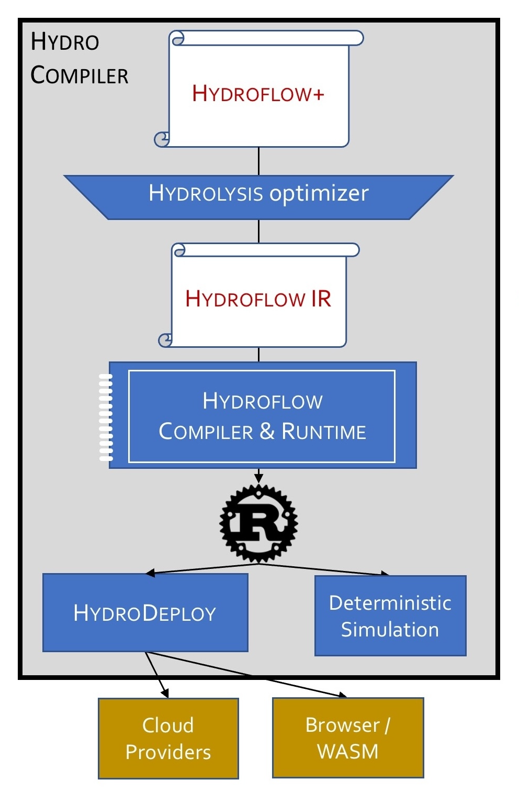

<h1 align="center">
    
</h1>

    
    

Hydro is a novel distributed programming library for standard Rust. Hydro allows developers to build distributed systems that are efficient, scalable, and correct. 

Hydro integrates naturally into standard Rust constructs and IDEs, providing types and programming constructs for ensuring distributed correctness. Under the covers it provides a metaprogrammed compiler that optimizes for cross-node issues of scaling and data movement while leveraging Rust and LLVM for per-node performance. 

We often describe Hydro via a metaphor: *LLVM for the cloud*. Like LLVM, Hydro is a layered compilation framework with a low-level Internal Representation language. In contrast to LLVM, Hydro focuses on distributed aspects of modern software. 
  

  

## The Language (and the Low-Level IR)
Hydro provides a [high-level language](https://hydro.run/docs/hydro) that allows you to program an entire fleet of processes from a single program, and then launch your fleet locally or in the cloud via [Hydro Deploy](https://hydro.run/docs/deploy). Get started with Hydro via the language [documentation](https://hydro.run/docs/hydro) and [examples](https://github.com/hydro-project/hydroflow/tree/main/hydroflow_plus_test/examples).

> Internally, the Hydro stack compiles Hydro programs into a low-level Dataflow Internal Representation (IR) language called [DFIR](https://hydro.run/docs/dfir); each process corresponds to a separate DFIR program. In rare cases you may want to compose one or more processes in DFIR by hand; see the DFIR [documentation](https://hydro.run/docs/dfir) or [examples](https://github.com/hydro-project/hydroflow/tree/main/hydroflow/examples) for details.

## Development Setup

See the [quickstart section of the Hydro book](https://hydro.run/docs/hydro/quickstart/) for instructions on installing Rust and getting started with the Hydro template.

# A New Approach to Distributed Programming
There have been many frameworks and platforms for distributed programming over the years, with significant tradeoffs:

**Higher level frameworks** have been designed to serve specialized distributed use cases. These including *Client-Server (Monolith)* frameworks  (e.g. Ruby on Rails + DBMS), parallel *Bulk Dataflow* frameworks (e.g. Spark, Flink, etc.), and step-wise *Workflows / Pipelines / Serverless / μservice Orchestration* frameworks (e.g. Kafka, Airflow). All of these frameworks offer limited expressibility and are inefficient outside their sweet spot. Each one ties developers' hands in different ways.

**Lower level asynchronous APIs** provide general-purpose distributed interfaces for sequential programming, including
    *RPCs*, *Async/Await* frameworks and *Actor* frameworks (e.g. Akka, Ray, Unison, Orleans, gRPC). These interfaces allow developers to build distributed systems *one async sequential process* at a time. While they offer low-level control of individual processes, they provide minimal help for global correctness of the fleet.

## Towards a more comprehensive approach
What's wanted, we believe, is a proper language stack addressing distributed concerns:

- **Broad Expressivity**: The stack should support a spectrum of performance regimes from lightweight, low-latency async event handling to high-throughput dataflow. It should also support a full range of architectural configurations, from [SPMD](https://en.wikipedia.org/wiki/Single_program,_multiple_data) to more heterogeneous architectures.
- **Familiarity**: The distributed aspects of the language should be integrated into a familiar mature programming language and environment, including libraries, IDEs and other tooling. A mature compiler should optimize local code to be fast and lean. (Hydro embraces Rust and LLVM for these attributes.)
- **Performance control**: The ability to program a fleet of machines "globally" should not prevent software engineers from optimizing the code that executes locally at each node.
- **Distributed Typechecking**: The type system of the language should enforce distributed correctness in the compiler, in ways that are visible in an IDE at time of authoring. For example, the types of data items should include their abstract locations, so that two items materialized at different nodes cannot be referenced together without an intervening construct for (async) communication.
- **Distributed Optimizations**: The compiler should be able to correctly optimize (transform) programs for distributed concerns: removing bottlenecks by flexibly assigning compute and data to different processes or clusters, while preserving program semantics.
- **Modularity**: The standard modularity of traditional programming—e.g. function calling abstractions—should work for distributed logic. For example, it should be possible to wrap a common cross-node construct like "heartbeats and timeouts", and invoke it as simply as one invokes a sequential function.
- **Native Testing Tools** for correctness. In today's standard practice, formal specification languages for testing (e.g. [TLA+](https://en.wikipedia.org/wiki/TLA%2B)) are separate from languages of implementation. We believe it should be possible to perform many kinds of formal testing (e.g. model checking) on the same code that is used in deployment. 

[Hydro](https://hydro.run) is a Rust library for distributed programming that is designed to address these goals.

# Learning More
The Hydro project's main website is at [https://hydro.run](https://hydro.run).

- **Docs**: There are docs for the [high-level Hydro language](https://hydro.run/docs/hydro/) and the low-level dataflow IR, [DFIR](https://hydro.run/docs/dfir), as well as the [HydroDeploy](https://hydro.run/docs/deploy) framework for launching Hydroflow+ programs.

- **Research Papers**: Our [research publications](https://hydro.run/research) are available on the project website. Some notable selections:
    - The original Hydro vision paper from CIDR 2021: [New Directions in Cloud Programming](https://hydro.run/papers/new-directions.pdf)
    - The first paper on optimizations from SIGMOD 2024: [Optimizing Distributed Protocols with Query Rewrites](https://hydro.run/papers/david-sigmod-2024.pdf)
    - The first paper on Hydro's formal semantics to appear in POPL 2025: [Flo: a Semantic Foundation for Progressive Stream Processing](https://arxiv.org/abs/2411.08274)
