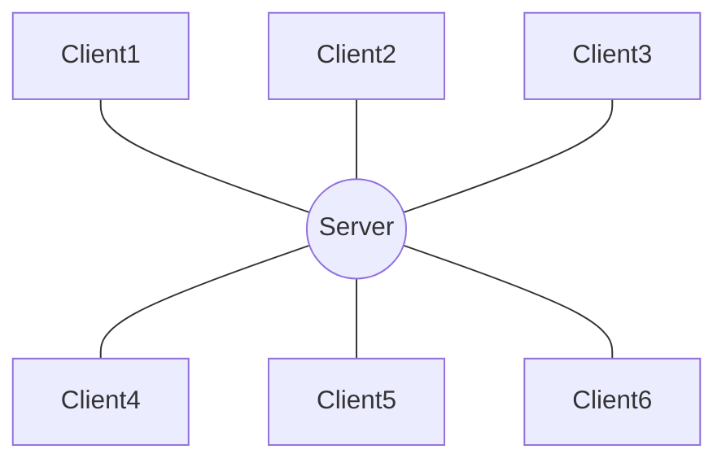
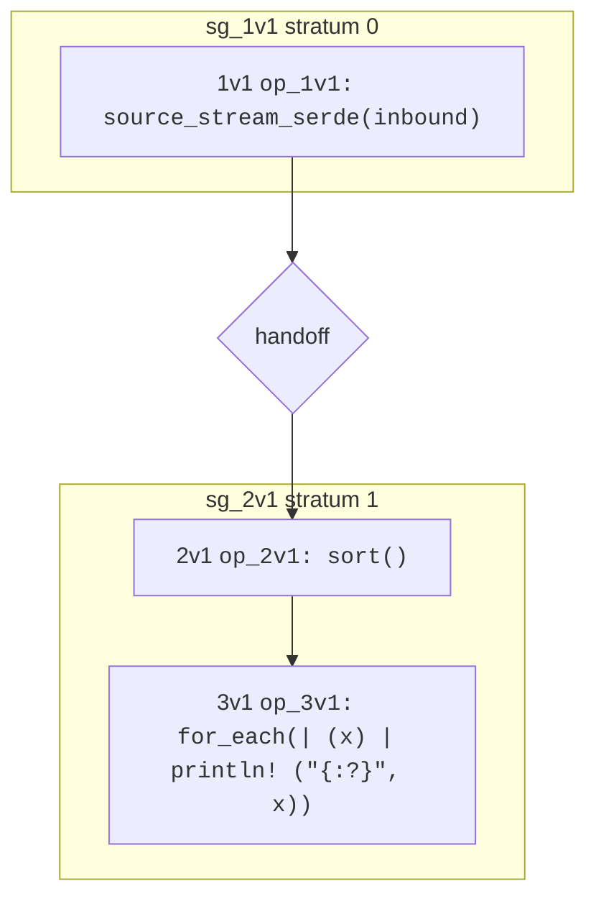

# Concepts
Hydroflow is different from other distributed systems infrastructure, so you probably have questions, like:
What is Hydroflow? How does it work? What is special about it, and what are the key concepts to understand?

This chapter covers those basic questions. We start simple describing Hydroflow, and build up to an understanding of 
what makes Hydroflow uniquely powerful.

But in case you want a preview of the Hydroflow goodies, here are the main themes:
1. **Distributed Correctness**: Hydroflow's type system can prevent distributed system bugs at compile time. (One example: will your code
produce the same results if you deploy on a single machine or replicate on a distributed cluster of machines?)
2. **Local Efficiency**: Hydroflow compiles your dataflow programs into efficient, low-latency, single-threaded executables.

More on these topics below.

## Hydroflow: A Runtime Library and a DSL in Rust
Let's skip the fanfare and keep things simple: what *is* Hydroflow?

Hydroflow is a library that can be used in any Rust program. It includes two main components:

1. A runtime library that executes low-latency, reactive dataflow programs written in Rust. (The *core API*.)
2. A domain-specific language (DSL) for specifying dataflow programs. (The Hydroflow *surface syntax*.) 

Hydroflow's surface syntax must be embedded in a Rust program; the Rust compiler takes that Hydroflow syntax and 
compiles it into an efficient binary executable. We call a running Hydroflow binary a *spinner*.

In typical usage, a developer writes a spinner as a single-threaded Rust program that is mostly composed of 
Hydroflow surface syntax. Each spinner is typically responsible for a single 
"node" (a machine, or a core) in a distributed system composed of many such spinners,
which send and receive flows of data to each other.

> Hydroflow itself does not generate distributed code. It is a library for specifying the spinners (individual nodes) that 
> participate in a distributed system. 
>
> Higher-level languages are being built on top of Hydroflow to generate 
> distributed code in the form of multiple spinners. 
> Meanwhile, you can use Hydroflow to write your own distributed code, by writing individual spinners that work together, 
> and deploying them manually or with a tool like [Hydroplane](https://github.com/hydro-project/hydroplane). See the [Hydro Ecosystem](./ecosystem.md) for more on this.

### So how might a human write distributed systems with Hydroflow?
As an illustration of how you can work at the Hydroflow layer, consider the 
[Chat Server example](./example_8_chat_server.md). If you run that binary
with the command-line argument `--role server` it will start a single spinner that is responsible for a chat server: receiving
membership requests and messages from clients, and forwarding messages from individual clients to all other clients.
If you run that binary with the argument `--role client` it will start a spinner that is responsible for a chat client, which 
forwards chat messages from stdin to the server, and prints out messages sent by the server. As a distributed system, the chat 
service would typically consist of many client spinners and a single server spinner.

Note that this is an example of an extremely simple distributed system in a "star" or "hub-and spokes" topology: the multiple client spinners are completely independent of each other, and each talks only with the central server spinner. 



 If we wanted something more interesting, we could consider deploying a cluster of multiple server spinners, say for fault tolerance or geo-distribution. We'd need to change the code to take advantage of the many servers in a correct and reliable manner. But that's a topic for another section; for now, let's stay focused on the basics. 

## The Life and Times of a Hydroflow Spinner
Like most reactive services, we can envision a Hydroflow spinner running as an unbounded loop that is managed 
by the runtime library. Each iteration of the spinner's loop is called a *tick*. Associated with the spinner is 
a current *clock* value, which tells you how many ticks were executed by this spinner prior to the current tick. Each 
spinner produces totally-ordered, sequentially increasing clock values, which you can think of as the "local logical time"
at the spinner.

The spinner's main loop works as follows:
1. Ingest a batch of data from one or more inbound channels, and deliver them to the appropriate `source_xxx` operators in the Hydroflow spec.
2. Execute the Hydroflow spec. If the spec has cycles, continue executing it until it reaches a "fixpoint" on the current batch; i.e. it no longer produces any new data anywhere in the flow. Along the way, any data that appears in an outbound channel is sent to the appropriate destination.
3. Advance the local clock before starting the next tick.

The spinner's main loop is shown in the following diagram:
**TODO**

In sum, an individual spinner advances sequentially through logical time; in each tick of its clock it ingests a batch of data from its inbound channels, executes the Hydroflow spec, and sends any outbound data to its outbound channels.
### Blocking Operators, Ticks and Strata
Many Hydroflow operators (e.g. `map`, `filter` and `join`) work in a streaming fashion. Streaming operators process data as it arrives, generating outputs in the midst of processing inputs. If you restrict yourself to operators that work in this streaming fashion, then your spinner may start sending data across the network mid-tick, even while it is still consuming the data in the input batch.

But some operators are blocking, and must wait for all their input data to arrive before they can produce any output data. For example, a `sort` operator must wait for all its input data to arrive before it can produce a single output value. (After all, the lowest value may be the last to arrive!)

This should raise questions in your mind. What do we mean by "all the input data" in a long-running service? We don't want to wait until the end of time, which is one reason we break time up into discrete "ticks" at each spinner. So when we say that a blocking operator waits for "all the input data", we mean "all the input data in the current tick".

Consider the simple statement below, which receives data from a network source each tick, sorts that tick's worth of data, and prints it to stdout:
```rust,ignore
source_stream_serde(inbound) -> sort() -> for_each(|x| println!("{:?}", x));
```
The runtime determines what data is taken from the channel and fed into the `source_stream_serde` operator for this tick. The sort operator will need to know that the `source_stream_serde` operator has no more data to send this tick, so that it can sort the data that got buffered and then send the sorted data to the `for_each` operator, which prints it to stdout. To do this, the runtime provides a mechanism for the `source_stream_serde` operator to buffer its output and notify the `sort` operator that it has no more data to send. This is called a *handoff*.

You can see the mermaid graph for the statement above just below this paragraph. Notice the two outer yellow boxes and the handoff between them. Each yellow boxes is a subflow that is
assigned a "stratum" number. ("Stratum" is latin for "layer"; the plural of "stratum" is "strata".) At compile time, the Hydroflow spec is partitioned into subflows, and each subflow is assigned a stratum number. Subsequently at runtime, within each tick the scheduler executes subflows in ascending order of stratum number. In the example above, the `source_stream_serde` operator is in stratum 0, and the `sort` and `for_each` operators are in stratum 1. The runtime executes the `source_stream_serde` operator first, buffering output in the Handoff. The `sort` operator will not receive any data until the `source_stream_serde` operator has finished executing. When stratum 0 is complete, the subflow in stratum 1 is scheduled and executes the `sort` and `for_each` operators to complete the tick. 



This allows us to refine our understanding of the Hydroflow spinner loop:
1. Ingest a batch of data from one or more inbound channels, and deliver them to the appropriate `source_xxx` operators in the Hydroflow spec.
2. For each stratum \[0..n\] in the Hydroflow spec, run the stratum to fixpoint, placing any outputs into handoffs or outbound channels. 
3. Advance the local clock before starting the next tick.

### Technical Notes on Stratification
The Hydroflow compiler performs a static analysis of the Hydroflow spec to determine the strata. The analysis is based on the following rules:
- A Handoff is inserted between a blocking operator and each of the "upstream" operators that supply it data.
- The flow is partitioned at the Handoffs into Handoff-free subflows called "strata".
- The resulting graph of strata and handoffs is tested to ensure that it's acyclic. Cycles through blocking operators are forbidden as they not have well-defined behavior. (Note that the blocking operators in a cycle would deadlock waiting for each other.)

So a legal Hydroflow program consists of a directed acyclic graph (DAG) of strata and handoffs. The strata are numbered in ascending order by assigning stratum number 0 to the "leaves" of the DAG (strata with no upstream operators), and then ensuring that each stratum is assigned a number that is one larger than any of its upstream strata.

When a Hydroflow operator executes, it is running on a particular spinner, in a particular tick, in a particular stratum. 


#### Determining whether an operator should block: Monotonicity
Why are some operators streaming, and others blocking? Intuitively, the blocking operators must hold off on emitting outputs early because they may receive another input that would change their output. For example, a `sort` operator on integers cannot emit the number 4 if it may subsequently receive a 3 within the same tick. Said differently, at any time during the tick, the sort must promise to emit a growing *prefix of the total order* of its input (e.g. "1", "1, 2", "1, 2, 3", "1, 2, 3, 4", etc.) It cannot do this if it has not yet received all the input data. 

By contrast, streaming operators like `filter` have the property that they can always emit an output, *regardless of what other data they will receive later in the tick*. 

Said differently, suppose the runtime chose a batch *B* of data to deliver to an operator in one run, and a batch *C* in another run, where *C* is a strict superset of *B* -- i.e. it contains all of *B* and some more additional data. The output of a streaming operator like `filter` on *C* is guaranteed to contain all the outputs of the operator on *B*. The mathematical term for this property is *monotonicity*; we say that *`filter` is a monotone function*, because its output stream is a growing (*monotone*) function of its input stream.

By contrast, the output of a blocking operator like `sort` on *B* (say "1, 2, 4") is not guaranteed to produce a prefix of the output of the operator on *C*; if the input was in fact *C* and contained 3, a `sort` that had previously emitted "1, 2, 4" would have to somehow "retract" that output, to allow it
to report the contradictory prefix "1, 2, 3". The mathematical term for this property is *non-monotonicity*; we say that *`sort` is a non-monotone function*, because its output stream is not a growing (*monotone*) function of its input stream.

Hydroflow uses the monotonicity property to determine whether an operator should block. If an operator is monotone, it is streaming. If an operator is non-monotone, it is blocking.

Monotonicity turns out to be particularly important for distributed systems. In particular, if all your spinners are fully monotone across ticks, then they can run in parallel without any coordination—they will always stream correct prefixes of the final outputs, and eventually will deliver the complete output. 

### Dataflow and Networking

Conventionally, dataflow systems provide a way to analyze and process data by
chaining functions (operators) together into pipelines. But with a change of
perspective, many computations can be represented as dataflow. Designing around
the flow of data naturally separates computation into easily parallelizable and
distributable pipelines.

Most dataflow systems provide opinionated mechanisms for running flows across
multiple machines. Hydroflow however aims to represent many more types of
computations besides just data processing. This includes networking protocols
like two-phase commit and Paxos. To this end, Hydroflow is unopinionated about
network communication. Additionally, Hydroflow provides the abstraction of only
a single node (single thread) of a system. To build up a distributed system,
the user must design each node to communicate with others as needed.

As development continues we will provide more utilities for common networking
use cases, but for now expect some manual management of IP addresses and
sockets.

### Models of Parallelism
### WIP: Lattices at the Core

### Across Ticks: Time and State

## A Note: Time, Distributed Systems and Hydroflow
## 
