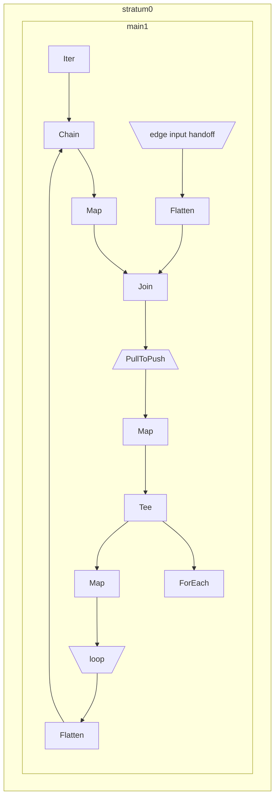

# Graph Reachability

So far all the operators we've used have one input and one output and therefore
create a linear graph. Let's now take a look at a Hydroflow program containing
a subgraph which has multiple inputs and outputs.
To motivate this, we'll tackle the simple problem of graph reachability. Given
a graph in the form of a streaming list of edges, which vertices can be reached
from the origin vertex?

Let's dive straight into the full code:

```rust
use hydroflow::builder::prelude::*;

pub fn main() {
    let mut builder = HydroflowBuilder::default();

    let (send_edges, recv_edges) =
        builder.add_channel_input::<_, _, VecHandoff<(usize, usize)>>("edge input");
    let (send_loop, recv_loop) = builder.make_edge::<_, VecHandoff<usize>, _>("loop");

    builder.add_subgraph(
        "main",
        std::iter::once(0)
            .into_hydroflow()
            .chain(recv_loop.flatten())
            .map(|v| (v, ()))
            .join(recv_edges.flatten())
            .pull_to_push()
            .map(|(_old_v, (), new_v)| new_v)
            .tee(
                builder.start_tee().for_each(|v| println!("Reached: {}", v)),
                builder.start_tee().map(Some).push_to(send_loop),
            ),
    );

    let mut hf = builder.build();
    println!("{}", hf.generate_mermaid());

    println!("A");
    send_edges.give(Some((5, 10)));
    send_edges.give(Some((0, 3)));
    send_edges.give(Some((3, 6)));
    send_edges.flush();
    hf.tick();

    println!("B");
    send_edges.give(Some((6, 5)));
    send_edges.flush();
    hf.tick();
}
```
```txt
A
Reached: 3
Reached: 6
B
Reached: 5
Reached: 10
```


TODO
