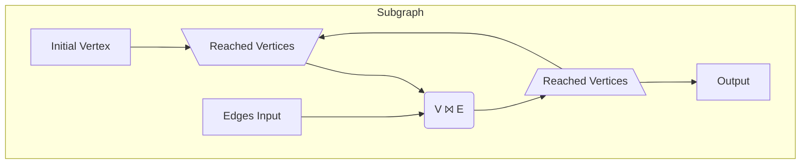
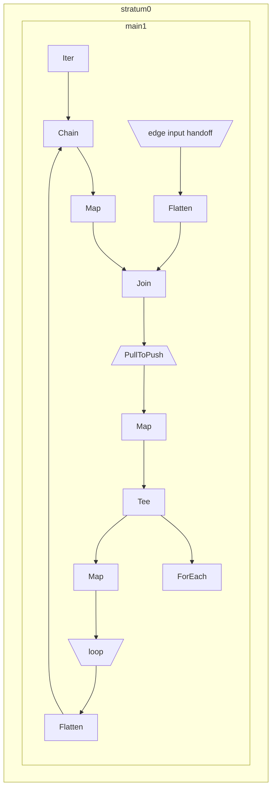

# Graph Reachability

So far all the operators we've used have one input and one output and therefore
create a linear graph. Let's now take a look at a Hydroflow program containing
a subgraph which has multiple inputs and outputs.
To motivate this, we'll tackle the simple problem of graph reachability. Given
a graph in the form of a streaming list of edges, which vertices can be reached
from the origin vertex?

It turns out this is very naturally represented as a dataflow program. We take
our initial starting vertex and join it with all its outgoing edges to get a
vertices one hop away. Then we join that set of vertices with the edges again
to get reachable vertices two hops away. If we repeat this in a loop we quickly
find all reachable vertices.

<!-- Note about monotonicity? -->

Here is a diagram of that dataflow program:



This dataflow program has a few interesting features including nodes with
multiple inputs or outputs as well as a loop. To represent this, we'll need to
know a bit more about _pull_ and _push_ operators. Essentially, any operator
which merges multiple inputs together must be a _pull_ operator. In this case
that is the `\Reached Vertices/` merge and the join `V ⨝ E`. And similarly, any
operator which splits to multiple outputs must be a _push_ operator, in this
case just the `/Reached Vertices\` split to the output.

Between the join and the split is where we go from pull to push. However from
the bottom `/Reached Vertices\` split back up the the `\Reached Vertices/`
merge we go from push to pull, which requires a handoff. The following code
creates a new handoff:

```rust,ignore
let (send_loop, recv_loop) = builder.make_edge::<_, VecHandoff<usize>, _>("loop");
```

The first `_` generic argument is the label type, then we have the
handoff type `VecHandoff<usize>` and the third specifies what wrapper type
(`Option`, `Single`, `Iter`) we will use to send to the handoff.

Lets take a look at the full code:
```rust
use hydroflow::builder::prelude::*;

pub fn main() {
    let mut builder = HydroflowBuilder::default();

    // Make the edges input.
    let (send_edges, recv_edges) =
        builder.add_channel_input::<_, _, VecHandoff<(usize, usize)>>("edge input");

    // Make the handoff for the loop.
    let (send_loop, recv_loop) = builder.make_edge::<_, VecHandoff<usize>, _>("loop");

    builder.add_subgraph(
        "main",
        std::iter::once(0)
            .into_hydroflow()
            .chain(recv_loop.flatten())
            .map(|v| (v, ()))
            .join(recv_edges.flatten())
            .map(|(_old_v, (), new_v)| new_v)
            .pull_to_push()
            .tee(
                builder.start_tee().for_each(|v| println!("Reached: {}", v)),
                builder.start_tee().map(Some).push_to(send_loop),
            ),
    );

    let mut hf = builder.build();
    println!("{}", hf.generate_mermaid());

    println!("A");
    send_edges.give(Some((5, 10)));
    send_edges.give(Some((0, 3)));
    send_edges.give(Some((3, 6)));
    send_edges.flush();
    hf.run_available();

    println!("B");
    send_edges.give(Some((6, 5)));
    send_edges.flush();
    hf.run_available();
}
```
```txt
A
Reached: 3
Reached: 6
B
Reached: 5
Reached: 10
```

As for the code itself, we start out with the origin vertex, `0`:
```rust,ignore
std::iter::once(0)
    .into_hydroflow()
```

Now we introduce the [`.chain()` operator](https://hydro-project.github.io/hydroflow/doc/hydroflow/builder/surface/trait.PullSurface.html#method.chain),
which allows you to connect two pull-based operators into one, which returns
the individual elements of both original operators. The name comes from Rust's
[`Iterator::chain`](https://doc.rust-lang.org/stable/std/iter/trait.Iterator.html#method.chain)
method, but unlike chain the elements will not neccesarily be ordered one
operator before the other. We'll probably change the name soon to emphasize
this.
```rust,ignore
    .chain(recv_loop.flatten())
```
This merges the `0` origin with any new reachable vertices from the loop
handoff.

Another way to connect two `pull-based` is with [`.join()`](https://hydro-project.github.io/hydroflow/doc/hydroflow/builder/surface/trait.PullSurface.html#method.join).
This acts like a SQL inner join. The inputs must have pair elements `(K, V1)`
and `(K, V2)`, and the operators joins them on equal keys and produces an
output of `(K, V1, V2)` elements. In this case we only want to join on `v` and
don't have any corresponding value, so we use [`.map()`](https://hydro-project.github.io/hydroflow/doc/hydroflow/builder/surface/trait.BaseSurface.html#method.map)
to get `(v, ())` elements. Meanwhile the `recv_edges` are `(from, to)` pairs,
so our output is `(from, (), to)` where `from` and now `to` are reachable
vertices.
```rust,ignore
    .map(|v| (v, ()))
    .join(recv_edges.flatten())
    .map(|(_old_v, (), new_v)| new_v)
```

After the `pull_to_push()` we have a [`.tee()` operator](https://hydro-project.github.io/hydroflow/doc/hydroflow/builder/surface/trait.PushSurface.html#method.tee),
which is similar to `.chain()` but instead of merging two pull-based operators
it outputs to multiple push-based operators. Each input element is cloned and
given to each of thw two outputs.
```rust,ignore
    .tee(
        builder.start_tee().for_each(|v| println!("Reached: {}", v)),
        builder.start_tee().map(Some).push_to(send_loop),
    )
```
[`builder.start_tee()`](https://hydro-project.github.io/hydroflow/doc/hydroflow/builder/prelude/struct.HydroflowBuilder.html#method.start_tee)
creates a new "disconnected" output for teeing to. In this case, one branch
prints out all the reached vertices for the user, while the other branch pushes
reached vertices back up into the `send_loop` handoff.

Then the remaining code runs the graph with some example edge data. There's
also some extra code here, particularly `hf.generate_mermaid()` which lets us
generate a diagram rendered by [Mermaid](https://mermaid-js.github.io/) showing
the structure of the graph:

This is similar to the graph above but has a few more operators, making it look
more complex. In particular, the `loop` handoff is important as it is what
allows the subgraph to recurse to itself.
