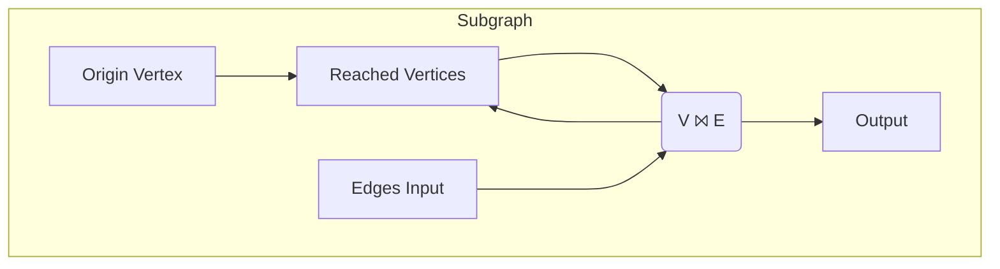
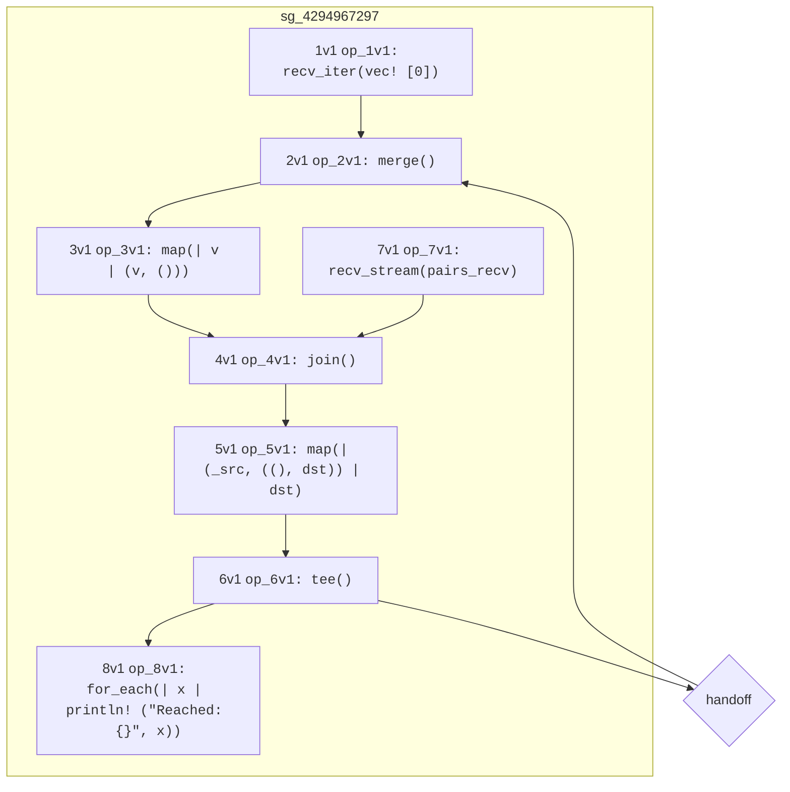

# Graph Reachability

So far all the operators we've used have one input and one output and therefore
create a linear graph. Let's now take a look at a Hydroflow program containing
a subgraph that has multiple inputs and outputs.
To motivate this, we'll tackle the simple problem of graph reachability. Given
a graph in the form of a streaming list of edges, which vertices can be reached
from a vertex passed in as the `origin`?

It turns out this is fairly naturally represented as a dataflow program. We take
our initial starting vertex and join it with all the edges---this finds
vertices one hop (edge) away. Then we join that set of vertices with the edges again
to get reachable vertices two hops away. If we repeat this in a loop we quickly
find all reachable vertices.

<!-- Note about monotonicity? -->

Here is an informal diagram of that dataflow program:

Note that the `Reached Vertices` node has two inbound edges; this sketch omits the operator to `merge` those
two inbound edges. Similarly note that the join node `V ⨝ E` not only has two inbound edges (which is 
normal for a join), it also has two _outbound_ edges; the sketch omits the operator to `tee` the output along 
two paths.

Lets take a look at some hydroflow code that implements the program, including the `merge` and `tee`:

```rust
pub fn main() {
    // An edge in the input data = a pair of `usize` vertex IDs.
    let (pairs_send, pairs_recv) = tokio::sync::mpsc::unbounded_channel::<(usize, usize)>();

    let mut flow = hydroflow_syntax! {
        // the origin vertex: node 0
        origin = recv_iter(vec![0]);
        reached_vertices = merge() -> map(|v| (v, ()));

        origin -> [0]reached_vertices;

        my_join_tee = join() -> map(|(_src, ((), dst))| dst) -> tee();
        reached_vertices -> [0]my_join_tee;
        recv_stream(pairs_recv) -> [1]my_join_tee;

        my_join_tee[0] -> [1]reached_vertices;
        my_join_tee[1] -> for_each(|x| println!("Reached: {}", x));
    };

    println!(
        "{}",
        flow.serde_graph()
            .expect("No graph found, maybe failed to parse.")
            .to_mermaid()
    );
    pairs_send.send((0, 1)).unwrap();
    pairs_send.send((2, 4)).unwrap();
    pairs_send.send((3, 4)).unwrap();
    pairs_send.send((1, 2)).unwrap();
    pairs_send.send((0, 3)).unwrap();
    pairs_send.send((0, 3)).unwrap();
    flow.run_available();
}
```

And the output:
```txt
Reached: 1
Reached: 3
Reached: 2
Reached: 4
Reached: 4
```

As for the code itself, we start out with the origin vertex, `0`:
```rust,ignore
    origin = recv_iter(vec![0]);
```

Now we introduce the [merge()](./surface_ops.md#merge) op to merge the output of 
two pull-based operators into one.
This merges the `0` origin with any new reachable vertices from the loop
handoff.

Another way to connect two `pull-based` is with [`join()`](./surface_ops.md#join).
This acts like a SQL inner join. The inputs must have pair elements `(K, V1)`
and `(K, V2)`, and the operator joins them on equal keys and produces an
output of `(K, V1, V2)` elements. In this case we only want to join on `v` and
don't have any corresponding value, so we use [`map()`](./surface_ops.md#map)
to generate `(v, ())` elements. Meanwhile the `pairs_recv` are `(from, to)` pairs,
so our output is `(from, (), to)` where `from` and now `to` are reachable
vertices.
```rust,ignore
    my_join_tee = join() -> map(|(_src, ((), dst))| dst) -> tee();
    reached_vertices -> [0]my_join_tee;
    recv_stream(pairs_recv) -> [1]my_join_tee;

```

Note that the `join()` has two inputs, and one output. The `join()` output feeds 
through a `map()` into a [`tee()`](./surface_ops.md#tee) operator,
which is the mirror image of `merge()`:  instead of merging many pull-based inputs to one output, 
it copies one input to many different different. Each input element is _cloned_, in Rust terms, and
given to each of the outputs.
In this case, one branch pushes reached vertices back up into the `reached_vertices` variable (which begins with a `merge`), while the other
prints out all the reached vertices for the user.
```rust,ignore
        my_join_tee[0] -> [1]reached_vertices;
        my_join_tee[1] -> for_each(|x| println!("Reached: {}", x));
```

Then the remaining code runs the graph with some example edge data. There's
also some extra code here, particularly `flow.to_mermaid()` which lets us
generate a diagram rendered by [Mermaid](https://mermaid-js.github.io/) showing
the structure of the graph:

This is similar to the graph above but has a few more operators, making it look
more complex. In particular, it includes the `merge` and `tee` operators, and compiles
in a `handoff` operator to break up the cycle and simplify the execution.
