# Graph Neighbors

So far all the operators we've used have one input and one output and therefore
create a linear flow of operators. Let's now take a look at a Hydroflow program containing
a subgraph which has multiple inputs; in the following examples we'll extend this to
multiple outputs.

To motivate this, we'll build a simple flow-based algorithm for the problem of *graph neighbors*. 
Given an abstract graph -- represented as data in the form of a streaming list of edges -- which 
vertices can be reached from a vertex passed in as the `origin`? It turns out this is fairly 
naturally represented as a dataflow program. 

> **Note on terminology**: In each of the next few examples, we're going to write a Hydroflow program (a dataflow graph) to process data that itself represents some other graph! To avoid confusion, in these examples, we'll refer to the Hydroflow program as a "flow" or "program", and the data as a "graph" of "edges" and "vertices".

To work our way up to graph reachability, we'll first start with a simple flow that finds
graph *neighbors*: nodes that are just one hop away. 

Our first Hydroflow program will take
our initial `origin` vertex as one input, and join it another input that streams in all the edges---this 
join will stream out the vertices that are one hop (edge) away from the starting vertex. 

Here is an *intuitive* diagram of that dataflow program (we'll see complete, autogenerated Hydroflow diagrams
below):

```mermaid
graph TD
  subgraph simple version
    00[Origin Vertex]
    01[Stream of Edges]
    
    20("V ⨝ E")
    40[Output]

    00 --> 20
    
    01 ---> 20
    20 --> 40
    
  end
```


Lets take a look at some hydroflow code that implements the program:

```rust
# use hydroflow::hydroflow_syntax;
pub fn main() {
    // An edge in the input data = a pair of `usize` vertex IDs.
    let (pairs_send, pairs_recv) = tokio::sync::mpsc::unbounded_channel::<(usize, usize)>();

    let mut flow = hydroflow_syntax! {
        // inputs: the origin vertex (node 0) and stream of input edges
        origin = recv_iter(vec![0]);
        stream_of_edges = recv_stream(pairs_recv);

        // the join
        my_join = join() -> map(|(_x, (_y, z))| z);
        origin -> map(|v| (v, ())) -> [0]my_join;
        stream_of_edges -> [1]my_join;

        // the output
        my_join -> for_each(|n| println!("Reached: {}", n));
    };

    println!(
        "{}",
        flow.serde_graph()
            .expect("No graph found, maybe failed to parse.")
            .to_mermaid()
    );
    pairs_send.send((0, 1)).unwrap();
    pairs_send.send((2, 4)).unwrap();
    pairs_send.send((3, 4)).unwrap();
    pairs_send.send((1, 2)).unwrap();
    pairs_send.send((0, 3)).unwrap();
    pairs_send.send((0, 3)).unwrap();
    flow.run_available();
}
```

And the output:
```txt
Reached: 1
Reached: 3
```
That looks right: the edges we "sent" into the flow that start at `0` are 
`(0, 1)` and `(0, 3)`.

As for the code itself, we start out with the origin vertex, `0`,
and the stream of edges coming in:
```rust,ignore
    origin = recv_iter(vec![0]);
    stream_of_edges = recv_stream(pairs_recv);
```
The Rust syntax `vec![0]` constructs a vector with a single element, `0`, which we iterate
over using `recv_iter`.

We then set up a [`join()`](./surface_ops.md#join),
we call `my_join`, which acts like a SQL inner join. Hydroflow's `join()` requires
a little massaging of its inputs to work properly.
The inputs must be of the form of a pair of elements `(K, V1)`
and `(K, V2)`, and the operator joins them on equal keys `K` and produces an
output of `(K, (V1, V2))` elements. In this case we only want to join on the key `v` and
don't have any corresponding value, so we feed `origin` through a [`map()`](./surface_ops.md#map)
to generate `(v, ())` elements as the first join input. 
```rust,ignore
    my_join = join() -> map(|(_x, (_y, z))| z);
    origin -> map(|v| (v, ())) -> [0]my_join;
    stream_of_edges -> [1]my_join;
```
The `stream_of_edges` are `(from, to)` pairs,
so the join's output is `(from, ((), to))` where `to` are new neighbor
vertices. So the `my_join` variable feeds the output of the join through a map to extract just the neighbor vertex.
Finally we print the neighbor vertices as follows:
```rust,ignore
    my_join -> for_each(|n| println!("Reached: {}", n));
```
The remaining code runs the graph on example edge data. There's
also some extra code there, particularly `flow.to_mermaid()` which lets us
generate a diagram rendered by [Mermaid](https://mermaid-js.github.io/) showing
the structure of the graph:


If you read the `pairs_send` calls in the code carefully, you'll see that the example data 
has nodes (`2`, `4`) that are more than one hop away from `0`, which were
not output by our simple program. To extend this example to graph *reachability*, 
we need to do this process many times. In Hydroflow,
this is done by adding a loop to the flow, as we'll see [next](example_4_1_surface.md).