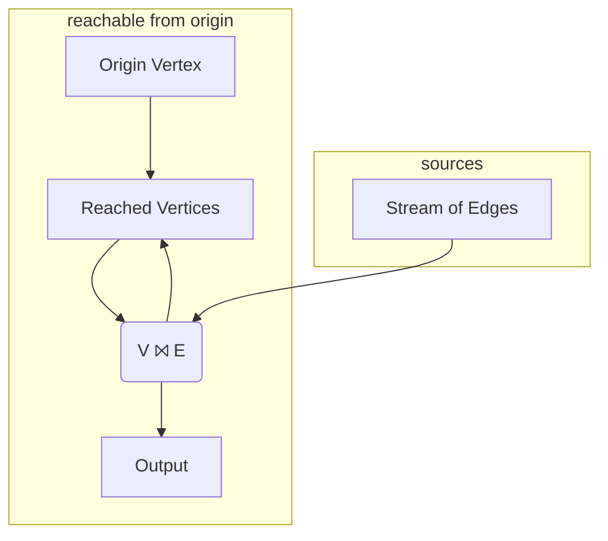
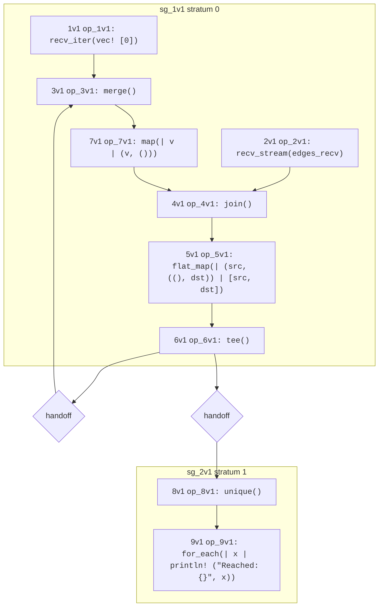

# Graph Reachability
To expand from graph neighbors to graph reachability, we want to find vertices that are connected not just to `origin`,
but also to vertices reachable *transitively* from `origin`. Said differently, a vertex is reachable from `origin` if it is
one of two cases: 
1. a neighbor of `origin` *or* 
2. a neighbor of some other vertex that is itself reachable from `origin`. 

It turns out this is a very small change to our Hydroflow program! It will also illustrate an operator, [`tee()`](./surface_ops.gen.md#tee),
which has multiple outputs.

Essentially we want to take *all* the reached vertices we found in our graph neighbors program,
and treat them recursively just as we treated `origin`.
To do this in a language like Hydroflow, we introduce a cycle in the flow:
we take the join output and have it
flow back into the join input. The modified intuitive graph looks like this:


Note that we added a `Reached Vertices` node to `merge` the two inbound edges corresponding to our 
two cases above. Similarly note that the join node `V ⨝ E` now has two _outbound_ edges; the sketch omits the operator 
to copy (`tee`) the output along 
two paths.

Now lets look at a modified version of our [graph neighbor](example_4_surface.md) code that implements this full program, including the loop as well as the `merge` and `tee`:

```rust
# use hydroflow::hydroflow_syntax;
pub fn main() {
    // An edge in the input data = a pair of `usize` vertex IDs.
    let (pairs_send, pairs_recv) = tokio::sync::mpsc::unbounded_channel::<(usize, usize)>();

    let mut flow = hydroflow_syntax! {
        // inputs: the origin vertex (vertex 0) and stream of input edges
        origin = recv_iter(vec![0]);
        stream_of_edges = recv_stream(pairs_recv);
        reached_vertices = merge();
        origin -> [0]reached_vertices;

        // the join
        my_join_tee = join() -> flat_map(|(src, ((), dst))| [src, dst]) -> tee();
        reached_vertices -> map(|v| (v, ())) -> [0]my_join_tee;
        stream_of_edges -> [1]my_join_tee;

        // the loop and the output
        my_join_tee[0] -> [1]reached_vertices;
        my_join_tee[1] -> unique() -> for_each(|x| println!("Reached: {}", x));
    };

    println!(
        "{}",
        flow.serde_graph()
            .expect("No graph found, maybe failed to parse.")
            .to_mermaid()
    );
    pairs_send.send((0, 1)).unwrap();
    pairs_send.send((2, 4)).unwrap();
    pairs_send.send((3, 4)).unwrap();
    pairs_send.send((1, 2)).unwrap();
    pairs_send.send((0, 3)).unwrap();
    pairs_send.send((0, 3)).unwrap();
    flow.run_available();
}
```

And now we get the full set of vertices reachable from `0`:
```txt
Reached: 3
Reached: 0
Reached: 2
Reached: 4
Reached: 1
```

Let's review the significant changes here. First, in setting up the inputs we have the 
addition of the `reached_vertices` variable, which uses the [merge()](./surface_ops.gen.md#merge) 
op to merge the output of two operators into one. 
We route the `origin` vertex into it as one input right away:
```rust,ignore
    reached_vertices = merge();
    origin -> [0]reached_vertices;
```
Note the square-bracket syntax for differentiating the multiple inputs to `merge()`
is the same as that of `join()` (except that merge can have an unbounded number of inputs,
whereas `join()` is defined to only have two.)

Now, `join()` is defined to only have one output. In our program, we want to copy 
the joined output 
output to two places: to the original `for_each` from above to print output, and *also* 
back to the `merge` operator we called `reached_vertices`.
We feed the `join()` output 
through a `flat_map()` as before, and then we feed the result into a [`tee()`](./surface_ops.gen.md#tee) operator,
which is the mirror image of `merge()`:  instead of merging many inputs to one output, 
it copies one input to many different outputs.  Each input element is _cloned_, in Rust terms, and
given to each of the outputs. The syntax for the outputs of `tee()` mirrors that of merge: we *append* 
an output index in square brackets to the `tee` or variable. In this example we have
`my_join_tee[0] ->` and `my_join_tee[1] ->`.

Finally, we process the output of the `join` as passed through the `tee`.
One branch pushes reached vertices back up into the `reached_vertices` variable (which begins with a `merge`), while the other
prints out all the reached vertices as in the simple program.
```rust,ignore
        my_join_tee[0] -> [1]reached_vertices;
        my_join_tee[1] -> for_each(|x| println!("Reached: {}", x));
```
Note the syntax for differentiating the *outputs* of a `tee()` is symmetric to that of `merge()`, 
showing up to the right of the variable rather than the left.

Below is the diagram rendered by [Mermaid](https://mermaid-js.github.io/) showing
the structure of the full flow:

This is similar to the flow for graph neighbors, but has a few more operators that make it look
more complex. In particular, it includes the `merge` and `tee` operators, and a cycle-forming back-edge 
that passes through an auto-generated `handoff` operator. This `handoff` is not a stratum boundary (after all, it connects stratum 0 to itself!) Rather, it represents a compilation boundary: the compiled code that hydroflow generates is acyclic (as discussed in the [Architecture Chapter](./architecture.md)\), so these handoffs tell the runtime to iterate on the acyclic code of a stratum until there is no new output from the stratum.
