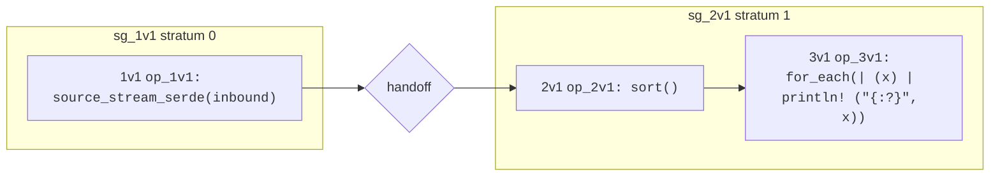

# Streaming, Blocking and Stratification
Many Hydroflow operators (e.g. `map`, `filter` and `join`) work in a streaming fashion. Streaming operators process data as it arrives, generating outputs in the midst of processing inputs. If you restrict yourself to operators that work in this streaming fashion, then your spinner may start sending data across the network mid-tick, even while it is still consuming the data in the input batch.

But some operators are blocking, and must wait for all their input data to arrive before they can produce any output data. For example, a `sort` operator must wait for all its input data to arrive before it can produce a single output value. (After all, the lowest value may be the last to arrive!)

The [`difference`](./surface_ops.gen.md#difference) operator is a mixed example. Like a set difference, it outputs all the items from its `pos` input that do not appear in its `neg` input. The `pos` input is streaming, and the `neg` input is blocking. Blocking on the `neg` input ensures that if the operator streams an output from the `pos` input, it will never need to retract that output.

This should raise questions in your mind. What do we mean by "all the input data" in a long-running service? We don't want to wait until the end of time, which is one reason we break time up into discrete "ticks" at each spinner. So when we say that a blocking operator waits for "all the input data", we mean "all the input data in the current tick".

Consider the simple statement below, which receives data from a network source each tick, sorts that tick's worth of data, and prints it to stdout:
```rust,ignore
source_stream_serde(inbound) -> sort() -> for_each(|x| println!("{:?}", x));
```
The runtime determines arbitrarily what batch of data is taken from the channel and fed into the `source_stream_serde` operator for this tick. The sort operator will need to know that the `source_stream_serde` operator has no more data to send this tick, so that it can sort the data that got buffered and then send the sorted data to the `for_each` operator, which prints it to stdout. To do this, the runtime provides a mechanism for the `source_stream_serde` operator to buffer its output and notify the `sort` operator that it has no more data to send. This is called a *handoff*.

You can see the mermaid graph for the statement above just below this paragraph. Notice the two outer yellow boxes and the handoff between them. Each yellow boxes is a subflow that is
assigned a *stratum* number. ("Stratum" is latin for "layer"; the plural of "stratum" is "strata".) 



At compile time, the Hydroflow spec is *stratified*: partitioned into subflows, where each subflow is assigned a stratum number. Subsequently at runtime, each tick executes the strata one-by-one in ascending order of stratum number. In the example above, the `source_stream_serde` operator is in stratum 0, and the `sort` and `for_each` operators are in stratum 1. The runtime executes the `source_stream_serde` operator first, buffering output in the Handoff. The `sort` operator will not receive any data until the `source_stream_serde` operator has finished executing. When stratum 0 is complete, the subflow in stratum 1 is scheduled and executes the `sort` and `for_each` operators to complete the tick. 


This allows us to refine our understanding of the Hydroflow spinner loop:
1. Ingest a batch of data from one or more inbound channels, deliver them to the appropriate `source_xxx` operators in the Hydroflow spec.
2. For each stratum \[0..n\] in the Hydroflow spec, run the stratum to fixpoint, placing any outputs into handoffs or outbound channels. 
3. Advance the local clock before starting the next tick.

## Technical Details
The concept of stratification is taken directly from stratified negation in [Datalog](https://en.wikipedia.org/wiki/Datalog), but Hydroflow applies it to any blocking operator, not just negation.

The Hydroflow compiler performs stratification via static analysis of the Hydroflow spec. The analysis is based on the following rules:
- A Handoff is interposed in front of any blocking input to an operator (as documented in the [operator definitions](./surface_ops.gen.md).
- The flow is partitioned at the Handoffs into Handoff-free subflows called "strata".
- The resulting graph of strata and Handoffs is tested to ensure that it's acyclic. (Cycles through blocking operators are forbidden as they not have well-defined behavior—note that the blocking operators in a cycle would deadlock waiting for each other.)

Given the acyclicity test, any legal Hydroflow program consists of a directed acyclic graph (DAG) of strata and handoffs. The strata are numbered in ascending order by assigning stratum number 0 to the "leaves" of the DAG (strata with no upstream operators), and then ensuring that each stratum is assigned a number that is one larger than any of its upstream strata.

As a Hydroflow operator executes, it is running on a particular spinner, in a particular tick, in a particular stratum. 


### Determining whether an operator should block: Monotonicity
Why are some inputs to operators streaming, and others blocking? Intuitively, the blocking operators must hold off on emitting outputs early because they may receive another input that would change their output. For example, a `difference` operator on integers cannot emit the number 4 from its `pos` input if it may subsequently receive a 4  within the same tick on the `neg` input. More generally, it cannot output anything until it has received all the `neg` input data. 

By contrast, streaming operators like `filter` have the property that they can always emit an output, *regardless of what other data they will receive later in the tick*. 

Mathematically, we can think of a dataflow operator as a function *f(in) -> out* from one batch of data to another. We call a function [monotone](https://en.wikipedia.org/wiki/Monotonic_function#In_order_theory) if its output is a growing function of its input. That is, *f* is classified as a monotone function if *f(B) ⊆ f(C)* whenever *B ⊆ C*.

By contrast, consider the output of a blocking operator like `difference`. The output of `difference` is a function of its inputs, but it is *non-monotone* with respect to its `neg` input: it is NOT the case that *A — B ⊆ A — C* whenever *B ⊆ C*. 

Hydroflow uses the monotonicity property to determine whether an operator should block. If an operator is monotone with
respect to an input, that input is streaming. If an operator is non-monotone, it is blocking.

Monotonicity turns out to be particularly important for distributed systems. In particular, if all your spinners are fully monotone across ticks, then they can run in parallel without any coordination—they will always stream correct prefixes of the final outputs, and eventually will deliver the complete output. This is the positive direction of the [CALM Theorem](https://cacm.acm.org/magazines/2020/9/246941-keeping-calm/fulltext).