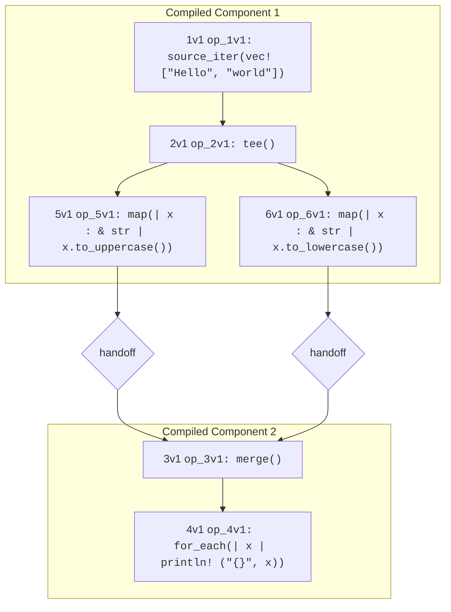

# Flow Syntax
Flows consist of named _operators_ that are connected via flow _edges_ denoted by `->`. The example below
uses the [`source_iter`](./surface_ops.gen.md#source_iter) operator to generate two strings from a Rust `vec`, the 
[`map`](./surface_ops.gen.md#map) operator to apply some Rust code to uppercase each string, and the [`for_each`](./surface_ops.gen.md#for_each) 
operator to print each string to stdout.
```rust,ignore
source_iter(vec!["Hello", "world"]) 
    -> map(|x| x.to_uppercase()) -> for_each(|x| println!("{}", x));
```

Flows can be assigned to variable names for convenience. E.g, the above can be rewritten as follows:
```rust,ignore
upper_print = map(|x| x.to_uppercase()) -> for_each(|x| println!("{}", x));
source_iter(vec!["Hello", "world"]) -> upper_print;
```
## Operators with Multiple Ports
Some operators have more than one input _port_ that can be referenced by `->`. For example [`merge`](./surface_ops.gen.md#merge) 
merges the contents of many flows, so it can have an abitrary number of input ports. Some operators have multiple outputs, notably [`tee`](./surface_ops.gen.md#tee),
which has an arbitrary number of outputs. 

In the syntax, we distinguish input ports via an _indexing prefix_ number
in square brackets before the operator name (e.g. `[0]merge(...)` and `[1]merge(...)`). We 
distinguish output ports by an _indexing suffix_ (e.g. `tee[0]`). 

Here is an example that tees one flow into two, handles each separately, and then merges them to print out the contents in both lowercase and uppercase:
```rust,ignore
source = source_iter(vec!["Hello", "world"]) -> tee();
print = merge() -> for_each(|x| println!("{}", x));
source[0] -> map(|x: &str| x.to_uppercase()) -> [0]print;
source[1] -> map(|x: &str| x.to_lowercase()) -> [1]print;
```
(Note that the Rust code inside map needed a little help with type inference after the `tee`.)

Here is a visualization of the flow that was generated:

Hydroflow compiled this flow into two subgraphs called _compiled components_, connected by _handoffs_. You can ignore 
these details unless you are interested in low-level performance tuning; they are explained in the discussion
of [in-out trees](./in-out_trees.md). 

### A note on assigning flows with multiple ports
> *TODO*: _Need to document the port numbers for variables assigned to tree- or dag-shaped flows_