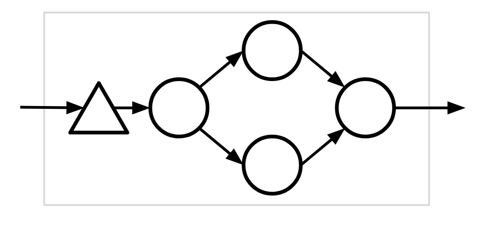
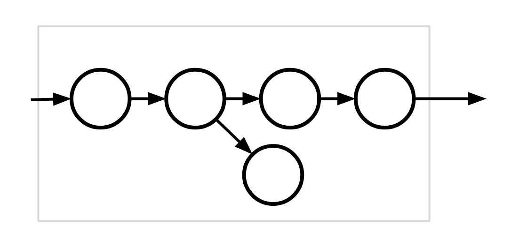
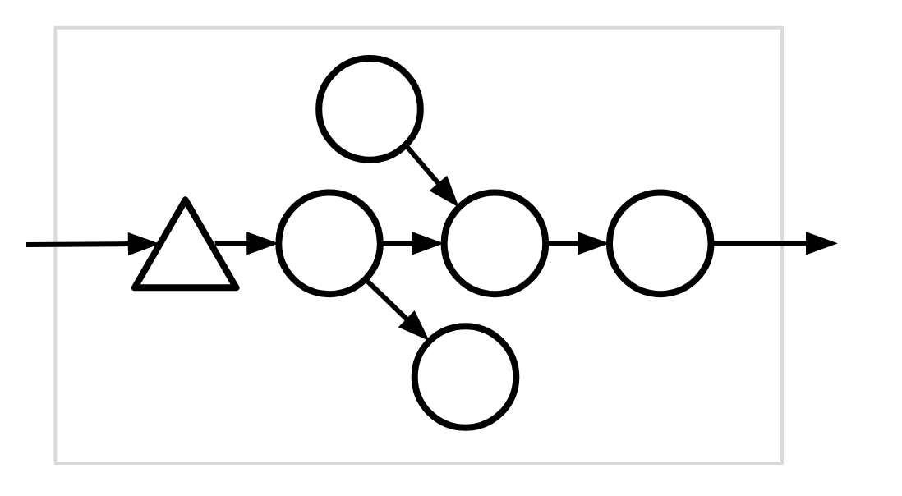
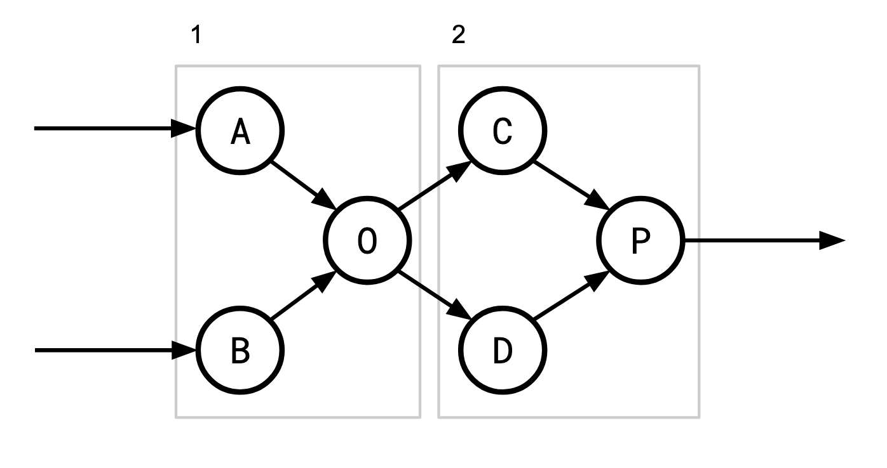
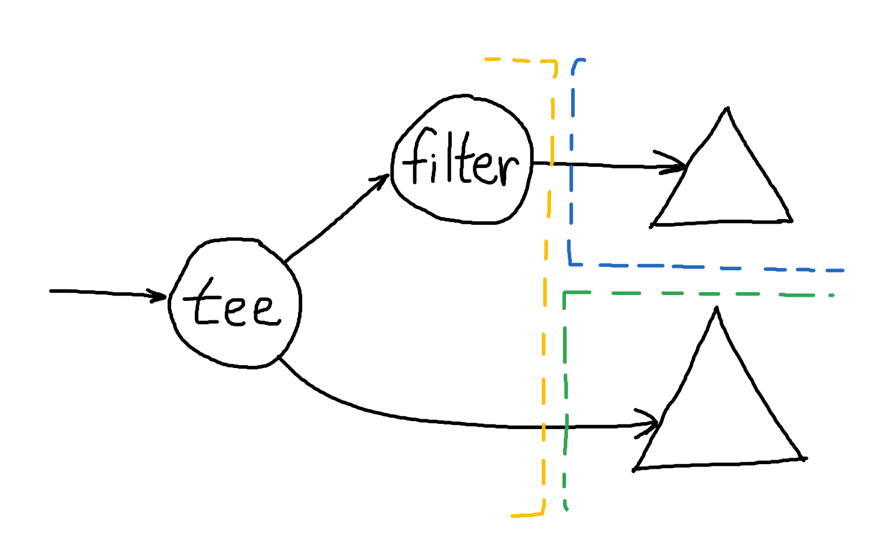

# Hydroflow Architecture Design Doc

# Goals
## Dataflow Requirements
- We expect DAGs and graphs with cycles to be useful for expressing some programs.
- We (may) want to handle dynamic graphs and graph transformations.
    - We may want “parallel” edges which each represent the same data but have different guarantees (such as our old delta vs cumul). This is part of the mechanism we came up with a long time ago to handle dynamically added edges.
## Mechanism Over Policy

We should give the flexibility to users or higher levels to choose how to construct their graphs, where to place their buffers, and how to schedule operators, while still having robust defaults.

## Explicit Parallelism

There are broadly two types of parallelism in dataflow graphs:

- Data parallelism (“horizontal”) - duplicating a subgraph across workers and partitioning data to parallelize the work, as in the Volcano `Exchange` operator.
- Operator parallelism (“vertical”) - partitioning operators on different workers.

We need to support both of them.

## Performance/Optimization
- Monomorphization: compiler should inline operators in sequence & remove dead code, as much as possible.
- Avoid unnecessary copying.
- Keep cost of scheduling low and thread-local when possible. Support batching to avoid scheduler and context-switching overhead.
# Benchmark Conclusions

*What’s possible in comp**il**ation/monomorphization*

The benchmarks show that Rust-style iterators and streams work well on linear or simple tree-shaped operator graphs. The “scheduling” within these simple graphs is trivial; do work and pass along data when it is available. “Scheduling” here is really coupling of control flow with the dataflow. The control flow is really determined in a “bottom-up” way in which the iterators or streams can continue to run or “deschedule” themselves based on what they return.

However this does not work well on complex graphs with complicated structure, particularly graphs with diamond-shaped structures and/or high degree nodes. Bottom-up scheduling gives operators control, but at that layer we have no knowledge on the overall structure of the graph.

Our benchmarks found that Timely does much better with complex graph topologies. Timely represents its dataflow as an actual graph data structure which lets Timely schedule tasks (somewhat) intelligently, top-down. In order to do this, it hides the types of operators and a Timely operator is typed only by its inputs and outputs (as opposed to a Rust iterator which is also typed by any iterator it wraps). This is bad for monomorphization but fantastic for flexibility. This sort of flexibility is needed if we want to represent dynamic graphs or do runtime optimization.

Ultimately, we think it makes sense to design a hybrid of these two designs to get the best of both worlds. The outer layer is be a Timely-style dataflow system with top-down scheduling, while the inner layer would exist as Rust iterator-based subgraphs within individual “Timely operators” (what we previously might’ve called “compiled components”).

# High-Level Design

Hydroflow graphs have a two-level structure. Operators in the inner “compiled” layer are monomorphized and as tightly as possible couple control flow and data flow by having operators directly invoke each other. Operators in the outer “scheduled” layer loosen this coupling by allowing operators to produce multiple results before yielding to the runtime, at which point an “eye in the sky” scheduler will decide what operator to invoke next.

This design allows for dataflow graphs to exist on a continuum of “more scheduled” vs. “more compiled.” One extreme, where each compiled subgraph contains a single vertex, simplifies to the Timely Dataflow model, which is completely flexible but has moderate overhead. The other extreme, where the entire dataflow graph is a *single* compiled subgraph, gives Rust iterators. Rust iterators have very little overhead but are also less flexible, both in terms of what graph topologies they can represent and the scheduling granularity they have access to.

## Terms
- “compiled layer” - the inner `Iter`-based layer which monomorphizes.
    - “small operator” or just “operator” - An operator within the compiled layer.
- “scheduled layer” - outer Timely-style scheduled layer.
    - “compiled subtree” (or “fat operator”) - A unit of the scheduled graph containing a subgraph of small operators compiled and monomorphized together. What Timely would simply call an “operator”, to be confusing.

In order to construct a Hydroflow graph, Hydroflow graphs must be partitioned into *compiled subtrees*. Each subgraph must be an *in-out tree* (or *bi-*[*arborescense*](https://en.wikipedia.org/wiki/Arborescence_(graph_theory))) which we define as a graph obeying the following constraints:

1. It is a [directed tree](https://en.wikipedia.org/wiki/Polytree).
2. The tree has a fan-in → fan-out structure and there is some “central vertex” which is on the path between every source/sink pair.
    1. Formally, you can divide the vertices into an IN set, OUT set, and single ROOT vertex. From any vertex in the IN to any vertex in the OUT set there is exactly one path, and that path goes through the ROOT.

Additionally for our compiled subtrees:

3. Every edge pointing into such a subgraph points to a handoff.

**Example #1** **(invalid)**




This compiled subgraph is invalid because the graph is not a directed tree.

**Example #2** **(invalid)**




This compiled subgraph is invalid because the input edge does not point at a handoff.

**Example #3** **(invalid)**




This compiled subgraph is invalid because there is no “central vertex.”

These structural constraints ensure that that chunk of code will be easy to represent in straightforward (possibly machine-generated) Rust. This design is in service of providing a flexible mechanism for higher-level components to make policy decisions about where buffers are appropriate for their particular application. One way to view a Hydroflow graph is that it resembles a Timely Dataflow graph where each operator contains a chunk of code representing the compiled subgraph.

## Example (valid)



There are of course multiple possible ways to partition this graph given the freedom to insert handoff points wherever we please.  In this diagram, `A`, `B`, `C`, and `D` would need handoff points which would accept input to be buffered for when their corresponding operators are scheduled. Another way to partition this would be `{A, B, O, C, D}` and `{P}` for example, which would require slightly different handoff points.

The (monomorphized) code for the compiled subgraphs themselves might look something like this:

**Subgraph 1**

```rust
  |a, b, c, d| {
    for x in a.iter().chain(b.iter()) {
      if x.is_even() {
        c.give(x);
      } else {
        d.give(x);
      }
    }
  }
```

**Subgraph 2**

```rust
|c, d, out| {
  for x in c.iter() {
    out.give(x);
  }
  for y in d.iter() {
    out.give(y);
  }
}
```

## Handoffs

Handoffs will be generic to allow multiple behaviors. Usually the handoff will be associated with a lattice type (such as `SetUnion<T>` i.e. a buffer), but we won’t enforce this assumption at the execution layer.

Some example possibilities:

- Buffer-like (I.e. a collection lattice such as set or map union, or a “sequence”), such as:
    - Unbounded buffers.
    - Fixed-size buffers which drop when overflowed.
    - Fixed-size buffers which panic when overflowed (mainly for debugging).
    - Fixed-size buffers which block (yield to scheduler) when overflowed.
- Lattice-like, merging when data arrives (note how the buffering behavior above is a refinement of this).
- Ordered (vectors/lists) vs Unordered (sets) vs Partitioned (hashMaps)
- Note that handoffs are *not* monotonic themselves—they get “drained” periodically. There needs to be logic at some level that ensures that their presence in the flow does not disrupt any guarantees.

Captured by the following traits:

```rust
trait Handoff<T> {
    // Succeeds if the Handoff accepted the input.
    fn try_give(&mut self, t: T) -> Result<()>;
}

// Implemented by Handoffs which can never fail to accept an input.
trait GuaranteedHandoff<T>: Handoff<T> {
    fn give(&mut self, t: T);
}
```

**2021-10-21 Update**
There’s `give` and `try_give`. For `try_give`, if you want to yield fast you should probably just give items in single or small batches and not in unbounded iterators. `try_give` returns the excess items, so it’ll return the remainder of the iterator.

Handoff operators are always one-to-one input-to-output. Although this has made performance a bit tricker to obtain.


## Scheduling

The types and locations of handoffs have effects on how the graph is (or can be) scheduled. By assuming all buffers are unbounded, Timely can ignore a lot of complexity in scheduling because operators do not have to wait for each other. A single operators runs and writes into an output buffer without yielding until its entire input buffer is emptied, and only then yields to the Timely scheduler (with minimal exception). The buffers effectively form “batches” of data which are what flow through the system. This is simple to implement but results in very coarse-grain scheduling and large batches.

Batches are not a bad thing—they increase memory locality (data and instruction), but we would like to have more precise control over them, and over scheduling. But we do not want complete control due to the complexity, as we see below.

For complete control, we would need fully blocking handoffs and operators which yield to the scheduler, but this comes with *a lot* of added complexity. Specifically, operators (now as coroutines) would need to be able to yield wherever they write to a handoff, and the scheduler would need to track the waits-for graph to prevent deadlock.




As an example, consider the graph above. The compiled subgraph on the left (yellow) may need to yield for either of the handoffs on the right. One possibility (Option A) is to get and tee an input eagerly, but if one handoff blocks then we will have to store the value (as part of the coroutine’s state machine) and yield. Another option (Option B) is to acquire a lease on both the handoffs first, ensuring there is room before processing any data, but then we may unnecessarily acquire a least on the top right (blue) handoff when data is filtered out. And operators like `flat_map` only add more cases like this. We would probably need to hook into Rust’s async-await futures system (or build a similar bespoke system) to implement something like this which adds a lot of complexity.

We propose a best-effort version of the above, to give the scheduler a lot (but not complete) control over operators, while avoiding excessive complexity. Handoffs can indicate to operators when they would like to stop receiving data, and then operators can yield where it makes sense to (in terms of the control flow). When handoffs do overflow (which we hope will be a rare case) they can then grow or drop (or panic) as configured.

So then a main objective of the scheduler is to keep all handoffs within their bounds, and to that end it tracks where there are handoffs that are more full than it would like, and invokes operators it knows will drain them. This highlights one potential tradeoff of having large compiled operators: once an operator is responsible for the inputs and outputs of *many* handoffs, it becomes more difficult for the scheduler to isolate the parts of the graph corresponding to any particular handoff. “Cousin operators” (operators within the same compiled subtree) with very different flow rates may cause tricky bottlenecks, so it might be beneficial to split a single compiled subtree into two or more smaller pieces. (This is *potentially* possible to do at *runtime*, a la JIT, but that’s later work).

Figuring out how to divide the overall operator graph into compiled subtrees will be an iterative process. The user (dev or compiler) needs to figure out where and what handoffs should be inserted. In the short term I think we probably will have to just say this is a job for the higher levels of the system until we learn enough to be opinionated about it.

**Dynamic Graphs**
Dynamic graphs are a BIG can of worms and we should really think carefully about them and all the alternatives before we make them a first-class feature (again). The scheduled layer can implement them since the graph structure is in data rather than compiled code. The smallest “atom” of modification would be a compiled subtree. This would likely add a lot of complexity to scheduling.
For now we will NOT implement this as it can be added in the future if it’s really needed.

## Interface

I don’t think we have strong opinions about this yet.

# Implementation Plan

Although the two layers (compiled and scheduled) are relatively independent, I think it’s worth pair programming the important bits of each layer together to make sure we have a good understanding of the code. We’ll start with the outer scheduled layer, then the inner layer. Once the foundation is implemented we can parallelize on the implementing mechanisms and specific operators separate to each layer.

----------
## Appendix: Timely vs. our Scheduled Layer
- Buffers
    - Timely buffers are `Vec<T>`, our “buffers” will be generic `T`, usually `T: Lattice`.
    - Timely assumes its buffers are unbounded, we may have bounded or single-item buffers.
- Scheduling
    - Infinite buffers greatly simplify Timely scheduling—operators never have to *wait for* other operators.
    - Our scheduler would have to handle *waits-for* dependencies between our compiled subtrees.
- Dynamic graphs
    - Timely graphs are static: once they are running they cannot be changed.
