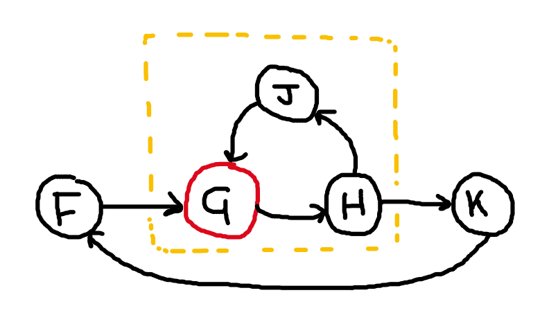
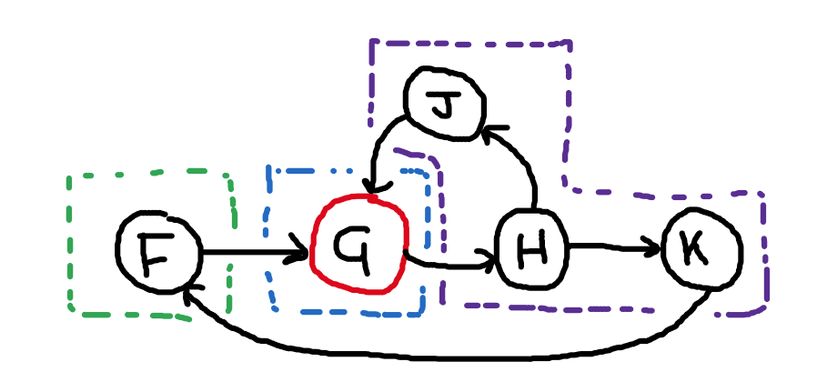

# Hydroflow Time & Strata Design Doc
2022-02

We need to figure out how to handle non-monotonic computation in Hydroflow’s execution model. This is necessary to run any Dedalus program with negation, including [David’s Paxos](https://github.com/davidchuyaya/bud-paxos/tree/b196358a5e34074f3ae57205bad8016ebb954792/dedalus-paxos).

We don’t even have a way to compute a non-monotonic operation as simple as set difference `C := A\B`, or in Dedalus: `C(x, l, t) :- A(x, l, t), ~B(x, l, t)`. In Hydroflow the facts of a Datalog program are tuples flowing along the graph. The node computing this difference will receive a stream of `A` values and a stream of `B` values, but currently cannot know when the stream of `B` values is done for the tick.

In general, we have to handle Datalog with stratified negation ("Stratified Datalog”). I can think of three ways to handle these programs: (1) stratification/barriers, (2) retractions.

Important to note is that positive (monotonic) loops are easy. They can be run until fixed-point regardless of stratification or retractions or time.

## 1. Stratification

This is the traditional way Stratified Datalog programs are executed. We partition the graph into an ordered set of *strata*. We execute one stratum (singular of strata) at a time, to fixed point, then continue onto the next stratum. In this way, by carefully controlling the execution order and getting to fixed points, we can avoid retracting any facts.

This also works with a global loop with negation: once we completely the final stratum we return to the first. We can count the number of global loops as the *tick*, and can use it as our local Lamport time. There is some extra consideration for buffering external events coming in, but won’t be hard to implement (see below).

**Requirements:**

1. Special notion of “strata”, which affects how things are scheduled
2. Notion of completion of a “stratum”
## 2. Retractions

Another way is to deal with non-monotonicity is through speculative execution and retractions. For the set difference example `A\B`, if we receive a fact `A(x)` (multiplicity `+1`) we can emit `x` immediately. But then if we receive `B(x)` we emit a retraction:  `x` with multiplicity `-1`.

This works fine with DAGs (and monotonic loops, which don’t need to retract). However once we have non-monotonic loops we have to reify the loop counter time to prevent contradictions. This is one way to use Timely, as its loops all have loop counters and all its tuples have multiplicity counts.

# Design

In our design we modify the scheduler to allow more precise control over the execution order of subgraphs. This corresponds pretty directly with the stratification strategy. We assume (for now) that each subgraph is associated with a known *stratum number*, and these strata are run in order.

We don’t want to force the user to use stratification, however. Because of the greater control over scheduling, this design hopefully will also make it possible to implement a Timely-like retraction-based (semi-?ring-based?) strategy. HOMEWORK: think about this more.

## Hydroflow’s current scheduler

To summarize, a Hydroflow graph is divided into subgraphs, and the operators within a subgraph are monomorphized (i.e. inlined & optimized) together. This means the Hydroflow scheduler can only schedule at the granularity of entire subgraphs.

The scheduler maintains a FIFO queue of subgraph IDs to run. Currently when a subgraph is run it drains the entirety of its input handoffs and pushes to its output handoffs. However in the original design doc we planned to allow for partial draining of handoffs to tune latency vs throughput. After a subgraph is run the scheduler checks each of the output handoffs and schedules successor subgraphs accordingly, pushing to the back of the FIFO queue. A scheduled bit is used to prevent double-pushing into the queue.

Currently the scheduler does not guarantee the order subgraphs will run in, nor does it guarantee how often or many times each subgraph is run. With loops, each subgraph in the loop causes the next to be scheduled, cycling until no more work can be done.

The current scheduler cannot handle strata because:

1. Because it does not control execution order, it cannot ensure each stratum is run in succession.
2. Because subgraphs may be scheduled repeatedly, arbitrarily many times, there is no notion of “completion” for the strata.
## Making the scheduler handle strata

We can solve both of the above problems with one mechanism. We assume each subgraph has a known single stratum number. Instead of running subgraphs in arbitrary order, run the subgraphs in a single stratum. When each stratum reaches fixed point (no more work), continue to the next stratum, in order.

This clearly solves (1), but it also indirectly solves (2). Any handoff which crosses strata will accumulate all values from the earlier stratum. Then when the later stratum runs we know the handoff we’re pulling from has received all values from the previous stratum’s run — *it is complete*. **Important**: we also need to ensure the handoff is also completely emptied each when the later stratum is run, otherwise we may see values from previous ticks which have been left behind.

## Implementation

Implementation should actually be very straightforward. We swap out the simple FIFO queue for either (1) a priority queue (ordered by `tick, strata`) or (2) a simple map or vec with stratum number keys/indices and FIFO queue values. Option (2) should perform better since we have a fixed number of strata.

## External Events

I actually think external events can arrive continuously, at any stratum. We may want the user to choose exactly how external events are buffered in order to tune low-latency (faster iteration of strata) vs higher throughput (more work done on the same stratum).

# Assigning Strata

For now we leave this as a task for a higher layer of the system. However it is not hard to automatically determine strata based on non-monotonic operators. The correctness condition is that all inputs to a non-monotonic operator must come from previous strata.

In this example, D is a non-monotonic operator. A and B should be in the same stratum so they can reach fixed-point. D cannot be in the same stratum as A and B since we cannot allow partial values (before fixed point) to reach D.

The simplest place to split the strata is between C and D. This guarantees that D comes directly after a handoff and therefore will receive a completed batch of values from the previous stratum. However it could also be allowable to put the split between B and C, as long as C always completely process its input values as well. In this case C acts as a “view” into the complete handoff for D.

However in order to keep things simple, we will keep handoffs as the first operator in their stratum. Any non-monotonic operators will likely need to materialize their entire input at once. If we allow operators such as C in between, we have to split up the buffer vec then re-collect for D.

In this example, the yellow subgraph is not a valid stratum. Even though G is an input to the stratum, there is also a loop in the stratum so not ***every*** **input to G is from previous stratum. Instead this loop acts as a global “graph” loop.

The following is a valid stratification in Dedalus (though not in Datalog in general! Dedalus’ use of time ensures this will be [locally stratified](http://infolab.stanford.edu/~ullman/cs345notes/slides01-9.pdf)). There are two “global” loops through negation, one through J and one through K and F. (Note that purple and green could be combined into one stratum). These loops through negation can be “resolved” by ensuring the clock ticks between (completed) iterations, ensuring local stratification.

