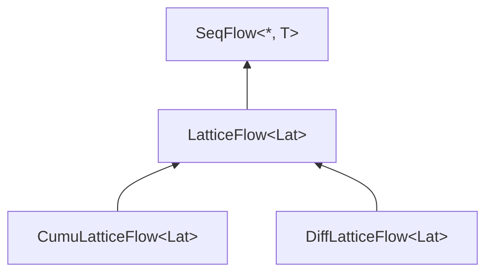
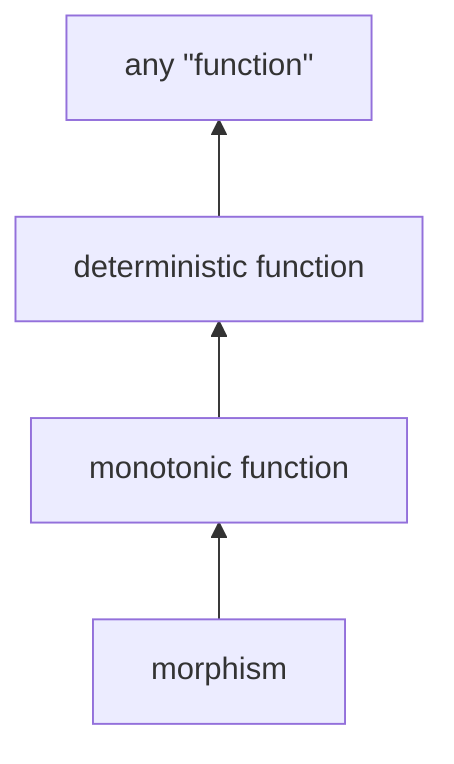
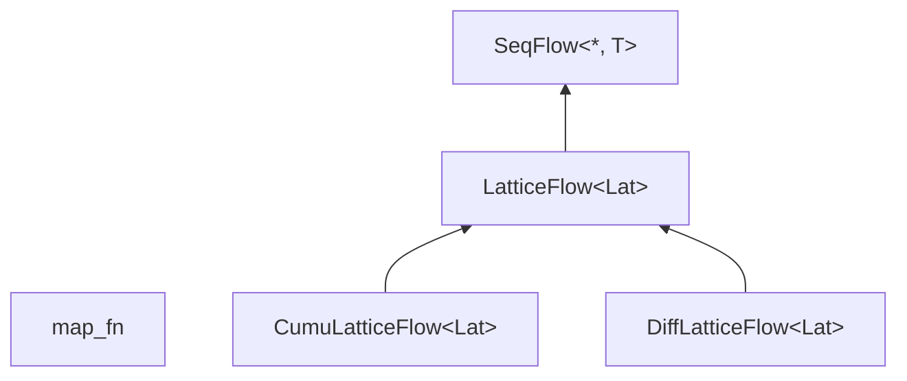

# Lattice Properties

## Goals

1. Make monotonicity the easy and default option, make non-monotonic operations the special case.
2. Reject operations that are incorrect (would violate monotonicity).  
   E.g. can't use a order-dependent fold on an arbitrarily ordered stream.
3. Reason about and optimize Hydroflow graphs at proc-macro time.  
   What portions can be parallelized, partitioned, etc.

## Design

Introduce _stream types_, as a layer on top of lattice types. The stream type represents sequential
information about the lattice instances, such as ordering, sorting, monotonicity, or atomization.

* `SeqFlow<*, T>`
* `LatticeFlow<Lat>`
* `DiffLatticeFlow<Lat>`
* `CumuLatticeFlow<Lat>`

`SeqFlow<T>` is a special per-element representation of the `Seq<*, T>` lattice type.

Stream types are **NOT** automatically infered. It will be up to the user to explicitly switch
between different stream types.
An alternative, using Rust's type system to infer stream types, is too fragile and more importantly
cannot be used a proc-macro time which prevents goal #3. Having the user manually specify stream
types ensures the scaling and monotonicity of the system will be top-of-mind, and avoids the
complexity of implementing our own type inference system.

Stream type topology. Stream types can be cast upwards:


Monotonic function topology:


---

Sending bottom $\bot$ through a [lattice flow] stream should have the exact same behavior as sending nothing
through.

<details>
   <summary>Note: bottom in a SeqStream is not SeqStream's bottom</summary>

```rust
Seq = VecUnion<Point<*, T>>
Seq bottom = vec![]
vec![bottom, bottom, bottom] is not Seq's bottom
```
</details>

## Operators



| Input(s) | Operator | Output(s) | Condition |
| --- | --- | --- | --- |
| `SeqFlow<*1, T>` | `map(f)` | `SeqFlow<*2, U>` | `f: Fn(T) -> U` |
| `LatticeFlow<Lat1>` | `map(f)` | `LatticeFlow<Lat2>` | `f: Fn(Lat1) -> Lat2` |
| `DiffLatticeFlow<Lat1>` | `map(f)` | `DiffLatticeFlow<Lat2>` | `f: Morphism(Lat1) -> Lat2` |
| `CumuLatticeFlow<Lat1>` | `map(f)` | `CumuLatticeFlow<Lat2>` | `f: MonotonicFn(Lat1) -> Lat2` |
| | | |
| `SeqFlow<*1, T>` | `filter(p)` | `SeqFlow<*2, T>` | `p: Fn(&T) -> bool` |
| `LatticeFlow<Lat1>` | `filter(p)` | `LatticeFlow<Lat1>` | `p: Morphism(&T) -> boolxxxx` |
| `DiffLatticeFlow<Lat1>` | `filter(p)` | `DiffLatticeFlow<Lat1>` | `p: Morphism(&T) -> boolxxxx` |
| `CumuLatticeFlow<Lat1>` | `filter(p)` | `CumuLatticeFlow<Lat1>` | `p: MonotonicFn(&T) -> Max<bool>` |
| | | |
| `SeqFlow<*1, (K, V1)>`, `SeqFlow<*2, (K, V2)>` | `join()` | `SeqFlow<*3, (K, (V1, V2))>` | |
| | | |
| `LatticeFlow<Lat>` | `unmerge()` | `DiffLatticeFlow<Lat>` | |
| `LatticeFlow<Lat>` | `merge()` | `CumuLatticeFlow<Lat>` | |
| any, $N$ times | `union()` | same out | |
| any | `tee()` | same out, $N$ times | |
| | | |
| `SeqFlow<*1, T>` | `sort()` | `SeqFlow<*SORT, T>` | |
| `LatticeFlow<Lat>` | `sort()` | `SeqFlow<*SORT, Lat>` | |
| | | |

---

| Input(s) | Operator | Output(s) | Condition |
| --- | --- | --- | --- |
| `SeqFlow<*1, T>` | `filter(p)` | `SeqFlow<*2, T>` | `p: Fn(&T) -> bool` |
| `CumuLatticeFlow<Lat1>` | `filter(p)` | `CumuLatticeFlow<Lat1>` | `p: Fn(&T) -> bool` |
| `[Diff]LatticeFlow<Lat1>` | `filter(p)` | `[Diff]LatticeFlow<Lat1>` | `p: Fn(&T) -> bool` |

```rust
// filter has CumuLatticeFlow input
input
   -> merge()
   // Legal
   // Good, monotonic fn
   -> filter(|set: HashSetUnion| set.contains("hello"))
   -> output

// VS

// filter has DiffLatticeFlow input
input
   // Good, monotonic fn (??morphism??)
   -> filter(|set: SingletonSetUnion| set.contains("hello"))
   -> merge()
   -> output

// VS

// filter has DiffLatticeFlow input
input
   -> merge_batch()
   // Non-deterministic
   -> filter(|set: HashSetUnion| set.contains("hello"))
   -> merge()
   -> output
```

---

With a `[Diff]LatticeFlow<Lat1>`

`[Diff]LatticeFlow<Lat>` should be isomorphic to a cumulative lattice flow.

---

`filter(P)` is equivalent to `map(|x| x.keep(P))` ?

$$
    f(a \sqcup_S b) \quad=\quad f(a) \sqcup_T f(b)
    \quad\quad\quad\mathrm{\textit{(morphism)}}
$$

```rust
// filter has CumuLatticeFlow input
input
   -> merge()
   // Legal
   // Good, monotonic fn
   -> filter(|set: HashSetUnion| set.contains("hello"))
   -> output

// VS

// filter has DiffLatticeFlow input
input
   // Good, monotonic fn (??morphism??)
   -> filter(|set: SingletonSetUnion| set.contains("hello"))
   -> merge()
   -> output

// VS

// filter has DiffLatticeFlow input
input
   -> merge_batch()
   // Non-deterministic
   -> filter(|set: HashSetUnion| set.contains("hello"))
   -> merge()
   -> output
```

---

```rust
// filter has CumuLatticeFlow input
input
   -> merge()
   // Good, monotonic
   -> filter(|set: HashSetUnion| set.len() > 10)
   -> output

// VS

// filter has DiffLatticeFlow input
input
   // singleton, silly
   -> filter(|set: SingletonSetUnion| set.len() > 10)
   -> merge()
   -> output

// VS

// filter has DiffLatticeFlow input
input
   -> merge_batch()
   // bad, non deterministic
   -> filter(|set: HashSetUnion| set.len() > 10)
   -> merge()
   -> output
```

---

```rust
input
   -> merge()
   // flat_map?
   -> map(|hash_set| hash_set.keep(|x| x.starts_with("hello")))
   -> output

// vs

input
   -> filter(|SingletonSet(x)| x.starts_with("hello"))
   -> merge()
   -> output
```

---


```rust
// filter has LatticeFlow input
input -> merge_batch() -> filter(P2) -> merge() -> output
```

```rust
P1 = |SingletonSet(x)| x.starts_with("hello")
P2 = |hash_set| hash_set.starts_with("hello")
```

```rust
P1 = |set| set.len() < 10
P2 = |set| set.len() < 10
```


```rust
// filter has CumuLatticeFlow input
input -> merge() -> filter(P1) -> output

// VS

// filter has [Diff]LatticeFlow input
input -> filter(P2) -> merge() -> output
```


