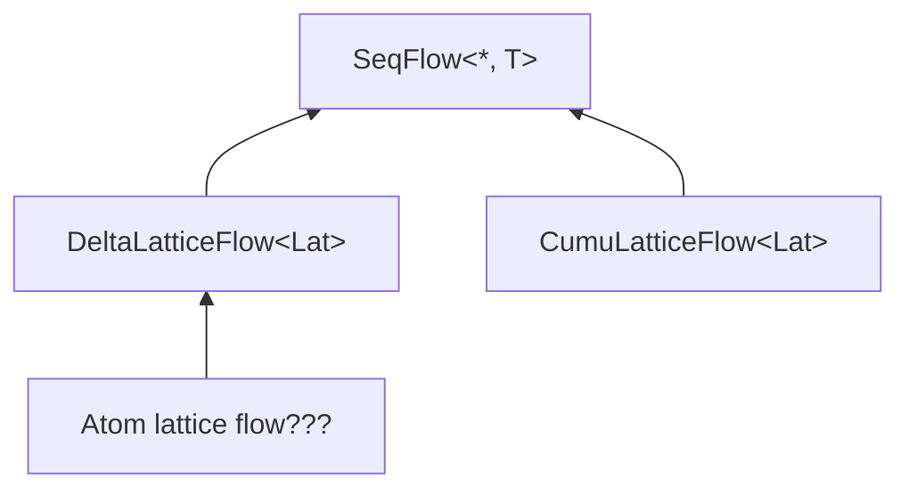
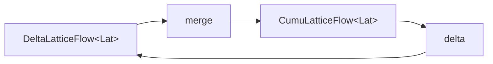
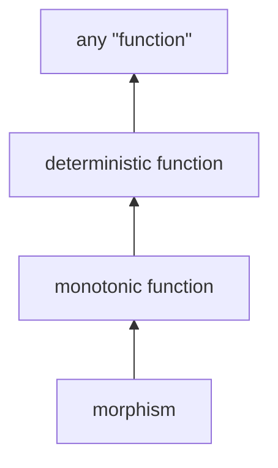

# Lattice Properties

## Goals

1. Make monotonicity the easy and default option, make non-monotonic operations the special case.
2. Reject operations that are incorrect (would violate monotonicity/determinism).  
    E.g. can't use a order-dependent fold on an arbitrarily ordered stream.
3. Reason about and optimize Hydroflow graphs at proc-macro time.  
    What portions can be parallelized, partitioned, etc.

## Design

Introduce _stream types_, as a layer on top of lattice types. The stream type represents sequential
information about the lattice instances, such as ordering, sorting, monotonicity, or atomization.

* `SeqFlow<*, T>`
* `LatticeFlow<Lat>`
* `CumuLatticeFlow<Lat>`

`SeqFlow<T>` is a special per-element representation of the `Seq<*, T>` lattice type.

Stream types are **NOT** automatically infered. It will be up to the user to explicitly switch
between different stream types.
An alternative, using Rust's type system to infer stream types, is too fragile and more importantly
cannot be used a proc-macro time which prevents goal #3. Having the user manually specify stream
types ensures the scaling and monotonicity of the system will be top-of-mind, and avoids the
complexity of implementing our own type inference system.


Items flowing through lattice flows are _lattice points_, not atoms. Not all lattices are
atomizable, and we want to have a lattice-first perspective.


Stream type topology. Stream types can be cast upwards:




Monotonic function topology:


---

Sending bottom $\bot$ through a [lattice flow] stream should have the exact same behavior as sending nothing
through.

<details>
    <summary>Note: bottom in a SeqStream is not SeqStream's bottom</summary>

```rust
Seq = VecUnion<Point<*, T>>
Seq bottom = vec![]
vec![bottom, bottom, bottom] is not Seq's bottom
```
</details>

## Operators

```rust
// input: set {1, 2, 3, 4}

// map stream
input -> random_batches()
    // input: { 1 }, { 2 }, { 3 }, { 4 }
    // NOT A MORPHISM ILLEGAL
    // the map function is a set union morphism if it acts on the atoms.
    -> map(|x: Set| if x.all(is_even) { OptionSet(x) } else { OptionSet(None) }) -> output
    // { 2 }, { 4 }

// filter stream
input -> atomize()
    // input: { 1 }, { 2 }, { 3 }, { 4 }
    -> filter(|x: Set| if x.all(is_even)) -> output
    // { 2 }, { 4 }
```

## TODO: start with cumul thing

```rust
// input: set {1, 2, 3, 4}

// map stream
input
    -> map(|x: Set| if x.all(is_even) { OptionSet(x) } else { OptionSet(None) }) -> output

// filter stream
input
    -> filter(|x: (x)| 0 == x % 2) -> output
    // { 2 }, { 4 }
```

| **Input(s)** | **Operator** | **Output(s)** | **Condition** |
| --- | --- | --- | --- |
| `SeqFlow<*1, T>` | `map(f)` | `SeqFlow<*2, U>` | `f: Fn(T) -> U` |
| `CumuLatticeFlow<Lat1>` | `map(f)` | `CumuLatticeFlow<Lat2>` | `f: MonotonicFn(Lat1) -> Lat2` |
| `LatticeFlow<Lat1>` | `map(f)` | `LatticeFlow<Lat2>` | `f: Morphism(Lat1) -> Lat2` |
|
| **Input(s)** | **Operator** | **Output(s)** | **Condition** |
| `SeqFlow<*1, T>` | `filter(p)` | `SeqFlow<*2, T>` | `p: Fn(&T) -> bool` |
| `CumuLatticeFlow<Lat>` | `filter(p)` | `CumuLatticeFlow<Lat>` | `f: MonotonicFn(&Lat) -> Max<bool>` |
| `LatticeFlow<Lat>` | `filter(p)` | Nope | no meaningful filter morphisms exist. Use `map` (convert atoms to bot) instead. |
|
| **Input(s)** | **Operator** | **Output(s)** | **Condition** |
| `SeqFlow<*1, T>` | `filter_map(f)` | `SeqFlow<*2, U>` | `f: Fn(T) -> Option<U>` |
| `CumuLatticeFlow<Lat1>` | `filter_map(f)` | `CumuLatticeFlow<Lat2>` | `f: MonotonicFn(&Lat1) -> WithBot<Lat2>` |
| `LatticeFlow<Lat1>` | `filter_map(f)` | Nope | see `filter(p)` for explanation |
|
| **Input(s)** | **Operator** | **Output(s)** | **Condition** |
| `LatticeFlow<Lat>` | `debottom()` | `LatticeFlow<Lat::Debottom>` | `Lat: Debottom` |
|
| **Input(s)** | **Operator** | **Output(s)** | **Condition** |
| `SeqFlow<*1, T>` | `tee()` | $N\times$ `SeqFlow<*1, T>` | |
| `LatticeFlow<Lat>` | `tee()` | $N\times$ `LatticeFlow<Lat>` | |
| `CumuLatticeFlow<Lat>` | `tee()` | $N\times$ `CumuLatticeFlow<Lat>` | |
|
| **Input(s)** | **Operator** | **Output(s)** | **Condition** |
| $N\times$ `SeqFlow<***, T>` | `union()` | `SeqFlow<*out, T>` | |
| $N\times$ `LatticeFlow<Lat>` | `union()` | `LatticeFlow<Lat>` | |
| $N\times$ `CumuLatticeFlow<Lat>` | `union()` | `LatticeFlow<Lat>` | Note: no longer `Cumu`. Mingwei: Unnatural? |
|
| **Input(s)** | **Operator** | **Output(s)** | **Condition** |
| `SeqFlow<*1, T>` | `fold(init, f)` | `SeqFlow<*2, U>` | `init: Fn() -> U`<br>`fold: Fn(U, T) -> U`
| `LatticeFlow<Lat1>` | `lattice_fold::<Lat2>()` | `CumuLatticeFlow<Lat2>` | `Lat2: Default` |
| `CumuLatticeFlow<Lat1>` | `lattice_fold::<Lat2>()` | `CumuLatticeFlow<Lat2>` | Silly, equivalent to just `map` with convert |
|
| **Input(s)** | **Operator** | **Output(s)** | **Condition** |
| `SeqFlow<*1, T>`<br>`SeqFlow<*2, U>` | `cross_join()` | `SeqFlow<*3, (T, U)>` | |
|
| `CumuLatticeFlow<Lat1>`<br>`CumuLatticeFlow<Lat2>` | `lattice_binary_map(f)` | `CumuLatticeFlow<Lat3>` | `f: BinaryMonotonicFn(Lat1, Lat2) -> Lat3` |
| `LatticeFlow<Lat1>`<br>`LatticeFlow<Lat2>` | `lattice_cross_join(f)` | `LatticeFlow<Lat3>` | `f: BinaryMorphism(Lat1, Lat2) -> Lat3` |
|
| `CumuLatticeFlow<Lat1>`<br>`LatticeFlow<Lat2>` | `lattice_half_binary_map(f)` | `LatticeFlow<Lat3>` | silly?<br>`f: BinaryMorphismRight(Lat1, Lat2) -> Lat3` |
| `LatticeFlow<Lat1>`<br>`CumuLatticeFlow<Lat2>` | `lattice_half_binary_map(f)` | `LatticeFlow<Lat3>` | silly?<br>`f: BinaryMorphismLeft(Lat1, Lat2) -> Lat3` |
|
| `SeqFlow<*1, (K, V1)>`<br>`SeqFlow<*2, (K, V2)>` | `join()` | `SeqFlow<*3, (K, (V1, V2))>` | |
| `LatticeFlow<MapUnion(K, Lat1)>`<br>`LatticeFlow<MapUnion<(K, Lat2)>` | `lattice_cross_join(keyed(f))`<br>`NEW_lattice_join(f)` | `LatticeFlow<MapUnion<(K, Lat3)>>` | `f: BinaryMorphism(Lat1, Lat2) -> Lat3` |
|
| **Input(s)** | **Operator** | **Output(s)** | **Condition** |
| `SeqFlow<*1, T>` | `CAST` | `SeqFlow<*1, T>` | ✅ |
| `SeqFlow<*1, Lat>` | `CAST` | `LatticeFlow<Lat>` | ❌ |
| `SeqFlow<*1, Lat>` | `CAST` | `CumuLatticeFlow<Lat>` | ❌ |
| `LatticeFlow<Lat>` | `CAST` | `SeqFlow<*1, Lat>` | ✅ |
| `LatticeFlow<Lat>` | `CAST` | `LatticeFlow<Lat>` | ✅ |
| `LatticeFlow<Lat>` | `CAST` | `CumuLatticeFlow<Lat>` | ❌ |
| `CumuLatticeFlow<Lat>` | `CAST` | `SeqFlow<*1, Lat>` | ✅ |
| `CumuLatticeFlow<Lat>` | `CAST` | `LatticeFlow<Lat>` | ✅ |
| `CumuLatticeFlow<Lat>` | `CAST` | `CumuLatticeFlow<Lat>` | ✅ |
|
| **Input(s)** | **Operator** | **Output(s)** | **Condition** |
| `SeqFlow<*1, T>` | `sort()` | `SeqFlow<SORTED<*1>, T>` | |
| `LatticeFlow<Lat>` | `sort()` | `LatticeFlow<Lat>` | |

$
\texttt{BinaryFn:}\quad R\times S \rightarrow T
$

$
    \texttt{BinaryMonotonicFn:}\quad
    a \sqsubseteq_R b,\;\; x \sqsubseteq_S y
    \quad\Longrightarrow\quad
    f(a, x)\ \sqsubseteq_T f(b, y)
$


$
    \texttt{BinaryMorphism:}\quad\\
    f(a\,\sqcup_R\,b,\; x) \quad=\quad f(a, x)\ \sqcup_T\ f(b, x) \\
    f(a,\; x\,\sqcup_S\,y) \quad=\quad f(a, x)\ \sqcup_T\ f(a, y)
$

Example: join

$
   join((a \sqcup b), x) = join(a, x) \sqcup join(b, x)
$

$
    (A \cup B) \bowtie (X \cup Y) = (A \bowtie X) \cup (A \bowtie Y) \cup (B \bowtie X) \cup (B \bowtie Y)
$

Lattice cross join:


$ f(\bigsqcup_tA \sqcup \delta_t a,\ \bigsqcup_t X) \rightarrow (\delta_t a,\ \bigsqcup_t X) $

$ f(\bigsqcup_t A,\ \bigsqcup_tX \sqcup \delta_t x) \rightarrow (\bigsqcup_t A,\ \delta_t x) $

---

```rust
source_iter(...) -> map(f) -> for_each(|x| println!("{:?}", x))

source_iter(...) -> deltify() -> dest_stream() ....
-> source_stream() -> merge() -> map(f) -> for_each(|x| println!("{:?}", x))
```

---

Users deal with `SeqFlow<*, T>` or `CumuLatticeFlow<Lat>`

`SeqFlow<*, T>`  
`LatticeFlow<Lat>` -> `SeqFlow<*, Lat>`  
`DeltaLatticeFlow<Lat>` is deltification of cumulative lattice flow

```rust
   --LF<L1>--> map(morph) --LF<L2>-->
   = --LF<L1>--> Deltify() --DLF<L1>--> Merge() --LF<L1>--> map(morph) --LF<L2>-->
   = --LF<L1>--> Deltify() --DLF<L1>--> map(morph) --DLF<L2>--> Merge() --LF<L2>-->

```

```rust
--LF--> Deltify() --DLF<L1>--> map(Non_Morphism()) --SeqFlow<*, Lat2>--> merge() --LF<Lat2>-->
!=
--LF--> Deltify() --DLF<L1>--> merge() --LF<2>--> map(Non_Morphism()) --LF<Lat2>--> 
```

```rust
source_iter([cumu]) --LF<L>--> map(f) --LF<L2>--> for_each(|x| println!("{:?}", x))

source_iter([cumu] --LF<L>--> deltify() --DLF<*1, L>--> dest_stream() ....
-> source_stream() --DLF<*2, L>--> merge() --DLF<*3, L>--> map(f) -> for_each(|x| println!("{:?}", x))
```

# Graph display notes

* monotone delta - green thin
* monotone cumul - green thick
* non-monotone - red

1 * a = a
a + a = a + a
1 * a + 1 * a = a + a
(1 + 1) * a = a + a
2 * a =  a + a


idempotent
a = a + a

a = 2 * a

different semiring for each f
2. a *f (y + dy) == a *f y + a *f dy


# Postponement stack:
* `AtomLatticeFlow`, should it exist?
* `Debottom`, bottomless lattices
* dependent sort orders (nested loops join)

| **Input(s)** | **Operator** | **Output(s)** | **Condition** |
| --- | --- | --- | --- |
| `LatticeFlow<Lat>` | `unmerge()` | `LatticeFlow<Lat>` | |
| `LatticeFlow<Lat>` | `merge()` | `CumuLatticeFlow<Lat>` | |
| | | |
| `SeqFlow<*1, T>` | `sort()` | `SeqFlow<*SORT, T>` | |
| `LatticeFlow<Lat>` | `sort()` | `SeqFlow<*SORT, Lat>` | |
| | | |

<br>
<br>
<br>
<br>
<br>
<br>
<br>
<br>
<br>
<br>
<br>
<br>
<br>
<br>
<br>
<br>

---

# junk stack

```rust
source_iter(vec![("a", 1), ("a", 2), ("b", 1), ("b", 3)]) 
   -> fold_keyed(MapUnion<str, MaxInt>::new(), |accum, elem| { accum.merge(MapUnion::from(elem.0, elem.1))})
   // { "a": MaxInt<2>, "b": MaxInt<3> }
   -> flatten() 
   // { ("a", MaxInt<2>), ("b", MaxInt<3>)}
   -> lattice_fold(MaxInt::Bot() )//, |accum, elem| {accum.merge(elem.1)})
   -> assert_eq(MaxInt::from(3))
```

```rust
source_iter(vec![("a", 1), ("a", 2), ("b", 1), ("b", 2)]) 
   -> fold_keyed(MapUnion<str, MaxInt>::new(), |accum, elem| { accum.merge(MapUnion::from(elem.0, elem.1))})
   // { "a": 2, "b": 2 }
   -> flat_map(|map_union| map_union.values())
   -> lattice_merge()
```


```rust
SeqFlow -> filter(|x| x != "hello") ->

LatticeFlow<SingletonSet<_>>
   -> map(|SingletonSet(x)| if x.starts_with("hello") {
         OptionSet::new(x)
      } else {
         OptionSet::new(None)
      })
   ->
```

```rust
LatticeFlow<Max<BigInt>> // Max<BigInt>
   -> map(|Max(x)| if 0 == x % 2 {
         WithBot::new(x)
      } else {
         WithBot::new(None)
      }) // WithBot<Max<BigInt>>
   -> debottom()
   // Max<BigInt>
   -> map(|Max(x)| /* do something else */)
```
```rust
WithBot<Lat>
OptionSet<T> /* equivalent to */ WithBot<SingletonSet<T>>
```