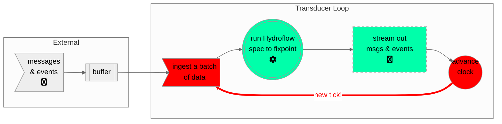

# The Life and Times of a Hydroflow Transducer
Time is a fundamental concept in many distributed systems. Hydroflow's model of time is very simple, but 
also powerful enough to serve as a building block for more complex models of time.

Like most reactive services, we can envision a Hydroflow transducer running as an unbounded loop that is managed 
by the runtime library. Each iteration of the transducer's loop is called a *tick*. Associated with the transducer is 
a *clock* value (accessible via the `.current_tick()` method), which tells you how many ticks were executed 
by this transducer prior to the current tick. Each transducer produces totally ordered, sequentially increasing clock values, 
which you can think of as the "local logical time" at the transducer.

The transducer's main loop works as follows:
1. Given events and messages buffered from the operating system, ingest a batch of data items and deliver them to the appropriate `source_xxx` operators in the Hydroflow spec.
2. Run the Hydroflow spec. If the spec has cycles, continue executing it until it reaches a "fixpoint" on the current batch; i.e. it no longer produces any new data anywhere in the flow. Along the way, any data that appears in an outbound channel is streamed to the appropriate destination.
3. Once the spec reaches fixpoint and messages have all been sent, advance the local clock and then start the next tick.

The transducer's main loop is shown in the following diagram:

In sum, an individual transducer advances sequentially through logical time; in each tick of its clock it ingests a batch of data from its inbound channels, executes the Hydroflow spec, and sends any outbound data to its outbound channels.