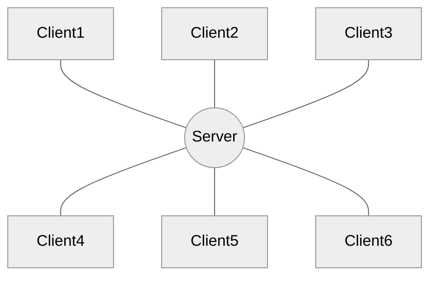
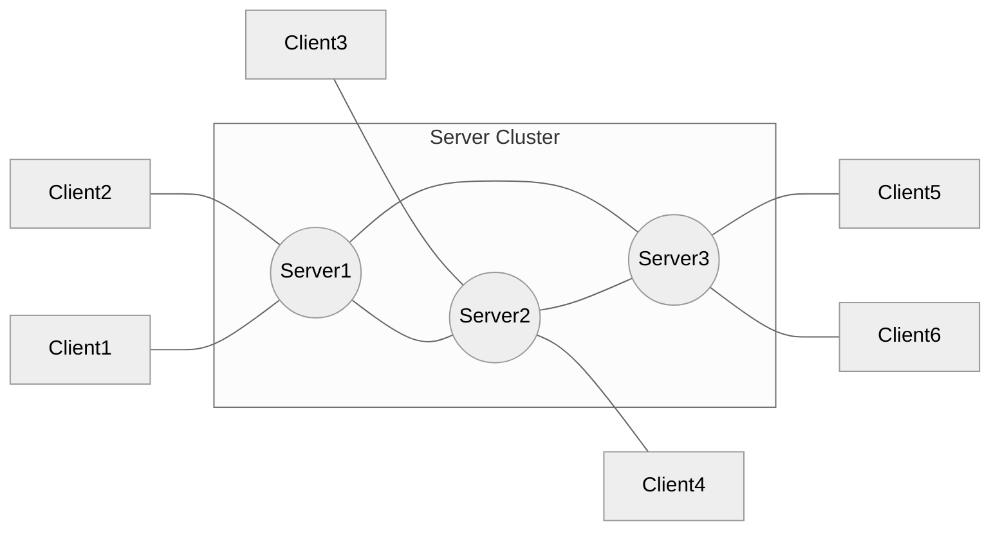

# Concepts
Hydroflow is different from other distributed systems infrastructure, so you probably have questions, like:
What is Hydroflow? How does it work? What is special about it, and what are the key concepts to understand?

This chapter covers those basic questions. We start simple describing Hydroflow, and build up to an understanding of 
what makes Hydroflow uniquely powerful.

But in case you want a preview of the Hydroflow goodies, here are the main themes:
1. **Distributed Correctness**: Hydroflow's type system can prevent distributed system bugs at compile time. (One example: will your code
produce the same results if you deploy on a single machine or replicate on a distributed cluster of machines?)  
2. **Local Efficiency**: Hydroflow compiles your dataflow programs into efficient, low-latency, single-threaded executables.

Taken together, Hydroflow provides a high-efficiency substrate on which to build powerful languages for distributed computing.

> Hydroflow's type system checks are not yet implemented, but they are coming soon!

## Hydroflow: A Runtime Library and a DSL in Rust
Setting fanfare aside, what *is* Hydroflow?

Hydroflow is a library that can be used in any Rust program. It includes two main components:

1. A runtime library that executes low-latency, reactive dataflow programs written in Rust. (The *core API*.)
2. A domain-specific language (DSL) for specifying dataflow programs. (The Hydroflow *surface syntax*.) 

Hydroflow's surface syntax must be embedded in a Rust program; the Rust compiler takes that Hydroflow syntax and 
compiles it into an efficient binary executable. 

> We call a running Hydroflow binary a *transducer*.

In typical usage, a developer writes a transducer as a single-threaded Rust program that is mostly composed of 
Hydroflow surface syntax. Each transducer is typically responsible for a single 
"node" (a machine, or a core) in a distributed system composed of many such transducers,
which send and receive flows of data to each other.

> Hydroflow itself does not generate distributed code. It is a library for specifying the transducers (individual nodes) that 
> participate in a distributed system. 
>
> In the [Hydro Project](https://hydro.run), higher-level languages are being built on top of Hydroflow to generate 
> distributed code in the form of multiple transducers. 
> Meanwhile, you can use Hydroflow to write your own distributed code, by writing individual transducers that work together, 
> and deploying them manually or with a tool like [Hydroplane](https://github.com/hydro-project/hydroplane). See the [Hydro Ecosystem](../ecosystem.md) for more on this.

### So how might a human write distributed systems with Hydroflow?
As an illustration of how you can work at the Hydroflow layer, consider the 
[Chat Server example](../quickstart/example_8_chat_server.md). If you run that binary
with the command-line argument `--role server` it will start a single transducer that is responsible for a chat server: receiving
membership requests and messages from clients, and forwarding messages from individual clients to all other clients.
If you run that binary with the argument `--role client` it will start a transducer that is responsible for a chat client, which 
forwards chat messages from stdin to the server, and prints out messages sent by the server. As a distributed system, the chat 
service would typically consist of many client transducers and a single server transducer.

Note that this is an example of an extremely simple distributed system in a "star" or "hub-and spokes" topology: the multiple client transducers are completely independent of each other, and each talks only with the central server transducer. 

 If we wanted something more interesting, we could consider deploying a cluster of multiple server transducers, say for fault tolerance or geo-distribution, perhaps like this: 
 
 

 We'd need to change the server code to get servers sharing their state in a correct and reliable manner. But that's a topic for another section **TODO**; for now, let's stay focused on the basics. 

