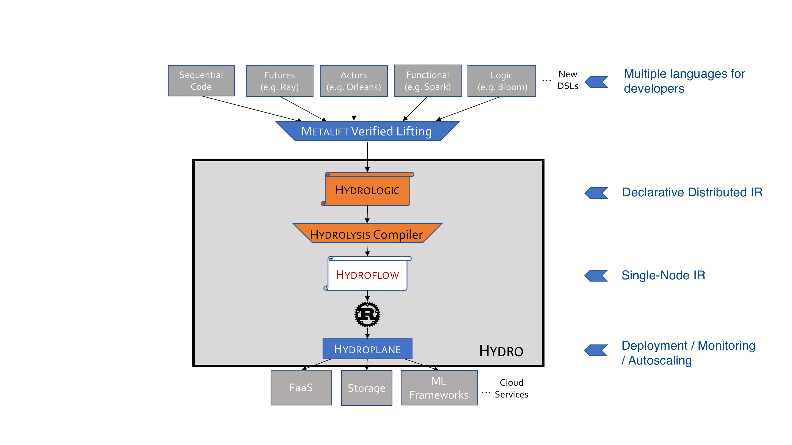

# The Hydro Ecosystem
The Hydro Project is an evolving stack of libraries and languages for distributed programming.
A rough picture of the envisioned Hydro stack is below:

The core of the Hydro stack is shown in in the grey box; components that have not been implemented are in orange. 

Working up from the bottom:

- [Hydroplane](https://github.com/hydro-project/hydroplane) is a service for launching and monitoring Hydroflow transducers. It works both on local developer machines with Docker, and in cloud services like AWS EKS. Over time we expect to add autoscaling features to Hydroplane, to allow users to configure the cluster to grow and shrink based on the monitored behavior and a pluggable policy.

- [Hydroflow](https://github.com/hydro-project/hydroplane) is the subject of this book; a library for defining individual transducers in a distributed system. It uses the Rust compiler to generate binaries for deployment.

- *Hydrolysis* is a compiler we envision translating from Hydrologic to Hydroflow.

- *Hydrologic* is a high-level domain-specific language that we envision for distributed programming. Unlike Hydroflow, we expect Hydrologic to abstract away many notions of distributed computing. In particular, Hydrologic will be insensitive to the specific deployment of the code—the partitioning of functionality and data across transducers, the number of replicas of each transducer, etc. Instead, programmers will provide specifications for desired properties like the number of failures to tolerate, the consistency desired at a given endpoint, the latency of a given endpoint, etc. The Hydrolysis compiler will then generate Hydroflow transducers that can be deployed by Hydroplane to meet those specifications.

- [Metalift](https://github.com/metalift/metalift) is a framework for "lifting" code from one language to a (typically higher-level) language. We envision that Metalift will be used to translate from one of many distributed programming models/languages into our common Internal Representation, Hydrologic.

The Hydro stack is inspired by previous language stacks including [LLVM](https://llvm.org) and [Halide](https://halide-lang.org), which similarly expose multiple human-programmable Internal Representation langauges.

An early paper on the Hydro vision appeared in CIDR 2021, under the title [New Directions in Cloud Programming](https://www.cidrdb.org/cidr2021/papers/cidr2021_paper16.pdf).