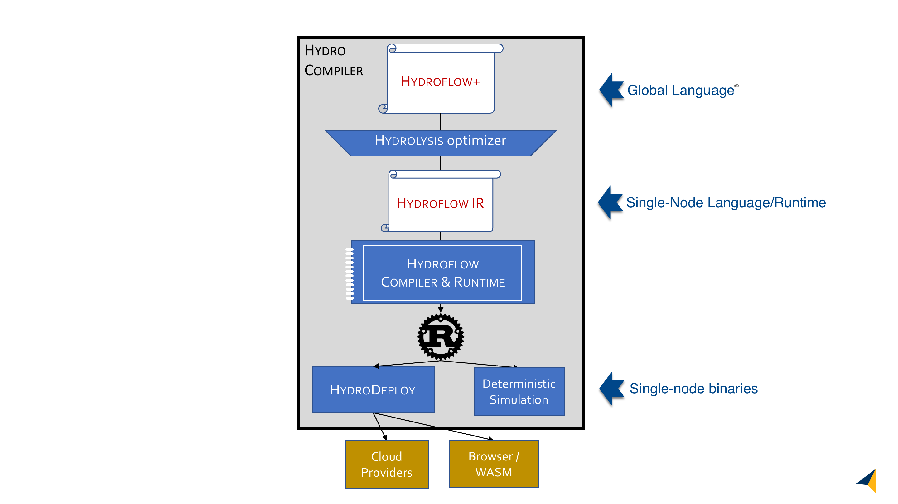

# The Hydro Ecosystem
The Hydro Project is an evolving stack of libraries and languages for distributed programming.
A rough picture of the Hydro stack is below:

Working down from the top:

- [*Hydroflow+*](../hydroflow_plus) is an end-user-facing high-level [choreographic](https://en.wikipedia.org/wiki/Choreographic_programming) [dataflow](https://en.wikipedia.org/wiki/Dataflow_programming) language. Hydroflow+ is a *global* language for programming a (potentially elastic) fleet of processes. It is insensitive to the specific deployment of the code—the partitioning of functionality and data across processes, the number of replicas of each process, etc. Instead, programmers provide specifications . The Hydrolysis compiler then generates Hydroflow processes that can be deployed by HydroDeploy to meet those specifications.

- *Hydrolysis* is a compiler that translates from Hydroflow+ to Hydroflow.
This compilation phase is currently a part of the Hydroflow+ codebase, but in time it will evolve into an optimizing compiler inspired by database query optimizers and [e-graphs](https://en.wikipedia.org/wiki/E-graph).

- [Hydroflow IR and its compiler/runtime](https://github.com/hydro-project/hydroflow/tree/main/hydroflow) are the subject of this book. 
Where Hydroflow+ is a *global* language for programming a fleet of processes, Hydroflow is a *local* language for programming a single process that participates in a distributed system. More specifically, Hydroflow is an internal representation (IR) language and runtime library that generates the low-level Rust code for an individual transducer. As a low-level IR, Hydroflow is not intended for the general-purpose programmer. For most users it is intended as a readable compiler target from Hydroflow+; advanced developers can also use it to manually program individual transducers.

- [HydroDeploy](../deploy) is a service for launching Hydroflow transducers on a variety of platforms.

- Hydro also supports *Deterministic Simulation Testing* to aid in debugging distributed programs. Documentation on this feature is forthcoming.

The Hydro stack is inspired by previous language stacks including [LLVM](https://llvm.org) and [Halide](https://halide-lang.org), which similarly expose multiple human-programmable Internal Representation langauges.
