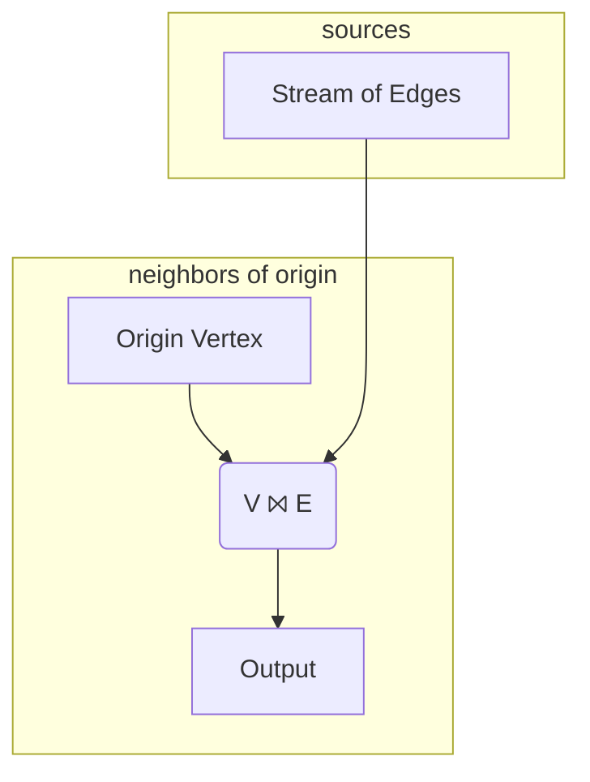

import CodeBlock from '@theme/CodeBlock';
import exampleCode from '!!raw-loader!../../../../hydroflow/examples/example_4_neighbors.rs';
import exampleOutput from '!!raw-loader!../../../../hydroflow/tests/snapshots/surface_examples__example_4_neighbors.snap';
import { getLines, extractOutput, extractMermaid } from '../../../src/util';

# Graph Neighbors
> In this example we cover:
> * Assigning sub-flows to variables
> * Our first multi-input operator, [`join`](../syntax/surface_ops_gen.md#join)
> * Indexing multi-input operators by prepending a bracket expression
> * The [`unique`](../syntax/surface_ops_gen.md#unique) operator for removing duplicates from a stream
> * Visualizing hydroflow code via `flow.meta_graph().expect(...).to_mermaid()`

So far all the operators we've used have one input and one output and therefore
create a linear flow of operators. Let's now take a look at a Hydroflow program containing
an operator which has multiple inputs; in the following examples we'll extend this to
multiple outputs.

To motivate this, we are going to start out on a little project of building a flow-based algorithm
for the problem of *graph reachability*.
Given an abstract graph—represented as data in the form of a streaming list of edges—which
vertices can be reached from a vertex passed in as the `origin`? It turns out this is fairly
naturally represented as a dataflow program.

> **Note on terminology**: In each of the next few examples, we're going to write a Hydroflow program (a dataflow graph) to process data that itself represents some other graph! To avoid confusion, in these examples, we'll refer to the Hydroflow program as a "flow" or "program", and the data as a "graph" of "edges" and "vertices".

## But First: Graph Neighbors
Graph reachability exercises a bunch of concepts at once, so we'll start here with a simpler flow that
finds graph *neighbors*: vertices that are just one hop away.

Our graph neighbors Hydroflow program will take
our initial `origin` vertex as one input, and join it another input that streams in all the edges—this
join will stream out the vertices that are one hop (edge) away from the starting vertex.

Here is an *intuitive* diagram of that dataflow program (we'll see complete, autogenerated Hydroflow diagrams
below):

Lets take a look at some Hydroflow code that implements the program. In your `simple` project,
replace the contents of `src/main.rs` with the following:

<CodeBlock language="rust" showLineNumbers>{exampleCode}</CodeBlock>

Run the program and focus on the last three lines of output, which come from `flow.run_available()`:

<CodeBlock language="console">{extractOutput(exampleOutput)}</CodeBlock>

That looks right: the edges we "sent" into the flow that start at `0` are
`(0, 1)` and `(0, 3)`, so the nodes reachable from `0` in 0 or 1 hops are `0, 1, 3`.

> Note: When you run the program you may see the lines printed out in a different order. That's OK; the flow we're defining here is producing a `set` of nodes, so the order in which they are printed out is not specified. The [`sort_by_key`](../syntax/surface_ops_gen.md#sort_by_key) operator can be used to sort the output of a flow.

## Examining the Hydroflow Code
In the code, we want to start out with the origin vertex, `0`,
and the stream of edges coming in. Because this flow is a bit more complex
than our earlier examples, we break it down into named "subflows", assigning them variable
names that we can reuse. Here we specify two subflows, `origin` and `stream_of_edges`:

<CodeBlock language="rust">{getLines(exampleCode, 8, 10)}</CodeBlock>

The Rust syntax `vec![0]` constructs a vector with a single element, `0`, which we iterate
over using `source_iter`.

We then set up a [`join()`](../syntax/surface_ops_gen.md#join) that we
name `my_join`, which acts like a SQL inner join.

<CodeBlock language="rust">{getLines(exampleCode, 12, 15)}</CodeBlock>

First, note the syntax for passing data into a subflow with multiple inputs requires us to *prepend*
an input index (starting at `0`) in square brackets to the multi-input variable name or operator.  In this example we have `-> [0]my_join`
and `-> [1]my_join`.

Hydroflow's `join()` API requires
a little massaging of its inputs to work properly.
The inputs must be of the form of a pair of elements `(K, V1)`
and `(K, V2)`, and the operator joins them on equal keys `K` and produces an
output of `(K, (V1, V2))` elements. In this case we only want to join on the key `v` and
don't have any corresponding value, so we feed `origin` through a [`map()`](../syntax/surface_ops_gen.md#map)
to generate `(v, ())` elements as the first join input.

The `stream_of_edges` are `(src, dst)` pairs,
so the join's output is `(src, ((), dst))` where `dst` values are new neighbor
vertices. So the `my_join` variable feeds the output of the join through a `flat_map` to extract the pairs into 2-item arrays, which are flattened to give us a list of all vertices reached.

Note that the order of the statements (lines) doesn't matter. In this example, `my_join` is
referenced before it is assigned, and that is completely OK and makes the code more readable.

Finally we print the neighbor vertices as follows:

<CodeBlock language="rust">{getLines(exampleCode, 17, 18)}</CodeBlock>

The [unique](../syntax/surface_ops_gen.md#unique) operator removes duplicates from the stream to make things more readable. Note that `unique` runs in a streaming fashion, which we will talk about more [later](./example_6_unreachability#strata-and-ticks).

There's
also some extra code here, `flow.meta_graph().expect(...).to_mermaid()`, which tells
Hydroflow to
generate a diagram rendered by [Mermaid](https://mermaid-js.github.io/) showing
the structure of the graph, and print it to stdout.
You can copy that text and paste it into the [Mermaid Live Editor](https://mermaid-js.github.io/mermaid-live-editor/)
to see the graph, which should look as follows:

<mermaid value={extractMermaid(exampleOutput)}></mermaid>

You may be wondering why the nodes in the graph have different colors (and shapes, for readers who cannot distinguish
colors easily). The answer has nothing to do with the meaning of the program, only with the way that Hydroflow compiles
operators into Rust. Simply put, blue (wide-topped) boxes _pull_ data, yellow (wide-bottomed) boxes _push_ data, and the `handoff` is a special operator that buffers pushed data for subsequent pulling. Hydroflow always places a handoff
between a push producer and a pull consumer, for reasons explained in the [Architecture](../architecture/index.md) chapter.

Returning to the code, if you read the `edges_send` calls carefully, you'll see that the example data
has vertices (`2`, `4`) that are more than one hop away from `0`, which were
not output by our simple program. To extend this example to graph *reachability*,
we need to recurse: find neighbors of our neighbors, neighbors of our neighbors' neighbors, and so on. In Hydroflow,
this is done by adding a loop to the flow, as we'll see in our [next example](example_5_reachability).

