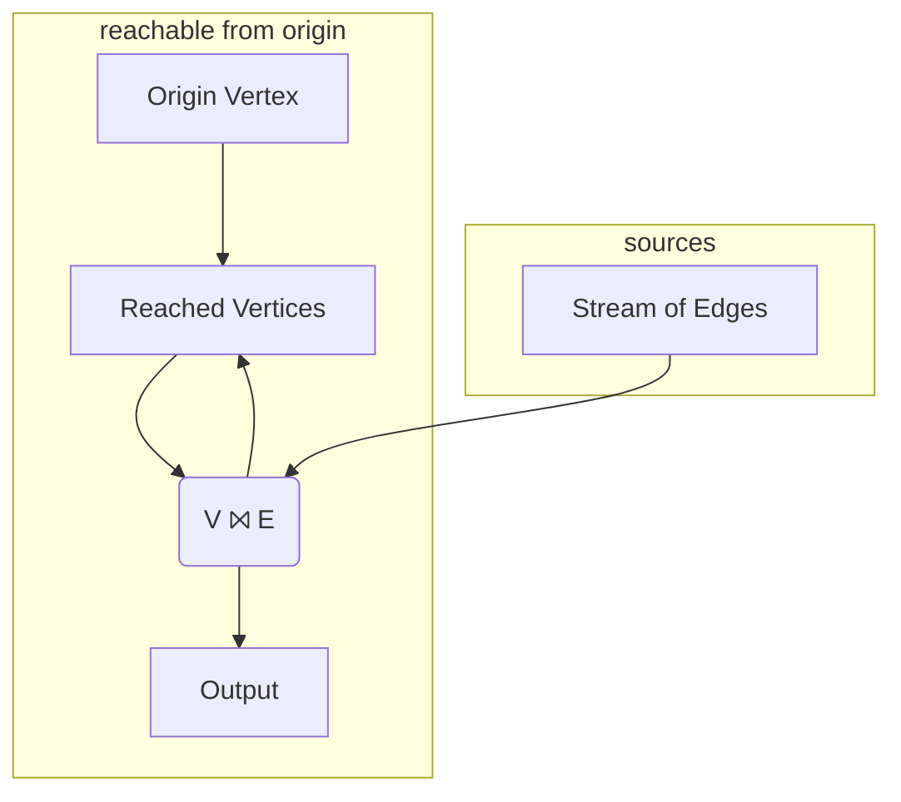
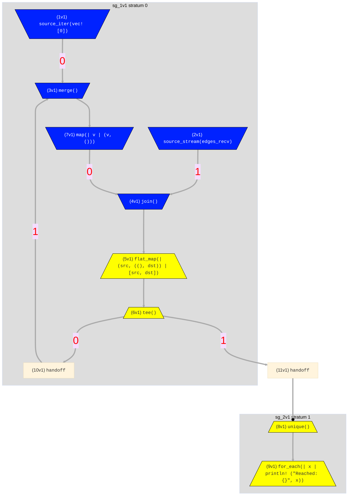

# Graph Reachability
> In this example we cover:
> * Implementing a recursive algorithm (graph reachability) via cyclic dataflow
> * Operators to merge data from multiple inputs ([`merge`](../syntax/surface_ops.gen.md#merge)), and send data to multiple outputs ([`tee`](../syntax/surface_ops.gen.md#tee))
> * Indexing multi-output operators by appending a bracket expression
> * An example of how a cyclic dataflow in one stratum executes to completion before starting the next stratum. 


To expand from graph neighbors to graph reachability, we want to find vertices that are connected not just to `origin`,
but also to vertices reachable *transitively* from `origin`. Said differently, a vertex is reachable from `origin` if it is
one of two cases: 
1. a neighbor of `origin` *or* 
2. a neighbor of some other vertex that is itself reachable from `origin`. 

It turns out this is a very small change to our Hydroflow program! Essentially we want to take *all* the reached vertices we found in our graph neighbors program,
and treat them recursively just as we treated `origin`.
To do this in a language like Hydroflow, we introduce a cycle in the flow:
we take the join output and have it
flow back into the join input. The modified intuitive graph looks like this:


Note that we added a `Reached Vertices` box to the diagram to merge the two inbound edges corresponding to our 
two cases above. Similarly note that the join box `V ⨝ E` now has two _outbound_ edges; the sketch omits the operator 
to copy ("tee") the output along 
two paths.

Now lets look at a modified version of our [graph neighbor](example_4_neighbors.md) code that implements this full program, including the loop as well as the Hydroflow [`merge`](../syntax/surface_ops.gen.md#merge) and [`tee`](../syntax/surface_ops.gen.md#tee).
Modify src/main.rs to look like this:

```rust
use hydroflow::hydroflow_syntax;

pub fn main() {
    // An edge in the input data = a pair of `usize` vertex IDs.
    let (edges_send, edges_recv) = hydroflow::util::unbounded_channel::<(usize, usize)>();

    let mut flow = hydroflow_syntax! {
        // inputs: the origin vertex (vertex 0) and stream of input edges
        origin = source_iter(vec![0]);
        stream_of_edges = source_stream(edges_recv);
        reached_vertices = merge();
        origin -> [0]reached_vertices;

        // the join
        my_join_tee = join() -> flat_map(|(src, ((), dst))| [src, dst]) -> tee();
        reached_vertices -> map(|v| (v, ())) -> [0]my_join_tee;
        stream_of_edges -> [1]my_join_tee;

        // the loop and the output
        my_join_tee[0] -> [1]reached_vertices;
        my_join_tee[1] -> unique() -> for_each(|x| println!("Reached: {}", x));
    };

    println!(
        "{}",
        flow.meta_graph()
            .expect("No graph found, maybe failed to parse.")
            .to_mermaid()
    );
    edges_send.send((0, 1)).unwrap();
    edges_send.send((2, 4)).unwrap();
    edges_send.send((3, 4)).unwrap();
    edges_send.send((1, 2)).unwrap();
    edges_send.send((0, 3)).unwrap();
    edges_send.send((0, 3)).unwrap();
    flow.run_available();
}
```

And now we get the full set of vertices reachable from `0`:
```console
#shell-command-next-line
cargo run
<build output>
<graph output>
Reached: 3
Reached: 0
Reached: 2
Reached: 4
Reached: 1
```

## Examining the Hydroflow Code
Let's review the significant changes here. First, in setting up the inputs we have the 
addition of the `reached_vertices` variable, which uses the [merge()](../syntax/surface_ops.gen.md#merge) 
op to merge the output of two operators into one. 
We route the `origin` vertex into it as one input right away:
```rust,ignore
    reached_vertices = merge();
    origin -> [0]reached_vertices;
```
Note the square-bracket syntax for differentiating the multiple inputs to `merge()`
is the same as that of `join()` (except that merge can have an unbounded number of inputs,
whereas `join()` is defined to only have two.)

Now, `join()` is defined to only have one output. In our program, we want to copy 
the joined output 
output to two places: to the original `for_each` from above to print output, and *also* 
back to the `merge` operator we called `reached_vertices`.
We feed the `join()` output 
through a `flat_map()` as before, and then we feed the result into a [`tee()`](../syntax/surface_ops.gen.md#tee) operator,
which is the mirror image of `merge()`:  instead of merging many inputs to one output, 
it copies one input to many different outputs.  Each input element is _cloned_, in Rust terms, and
given to each of the outputs. The syntax for the outputs of `tee()` mirrors that of merge: we *append* 
an output index in square brackets to the `tee` or variable. In this example we have
`my_join_tee[0] ->` and `my_join_tee[1] ->`.

Finally, we process the output of the `join` as passed through the `tee`.
One branch pushes reached vertices back up into the `reached_vertices` variable (which begins with a `merge`), while the other
prints out all the reached vertices as in the simple program.
```rust,ignore
        my_join_tee[0] -> [1]reached_vertices;
        my_join_tee[1] -> for_each(|x| println!("Reached: {}", x));
```
Note the syntax for differentiating the *outputs* of a `tee()` is symmetric to that of `merge()`, 
showing up to the right of the variable rather than the left.

Below is the diagram rendered by [mermaid](https://mermaid-js.github.io/) showing
the structure of the full flow:

This is similar to the flow for graph neighbors, but has a few more operators that make it look
more complex. In particular, it includes the `merge` and `tee` operators, and a cycle-forming back-edge 
that passes through an auto-generated `handoff` operator. This `handoff` is not a stratum boundary (after all, it connects stratum 0 to itself!) It simply enforces the rule that a push producer and a pull consumer must be separated by a `handoff`. 

Meanwhile, note that there is once again a stratum boundary between the stratum 0 with its recursive loop, and stratum 1 that computes `unique`, with the blocking input. This means that Hydroflow will first run the loop of stratum 0 repeatedly until all the transitive reached vertices are found, before moving on to compute the unique reached vertices.
