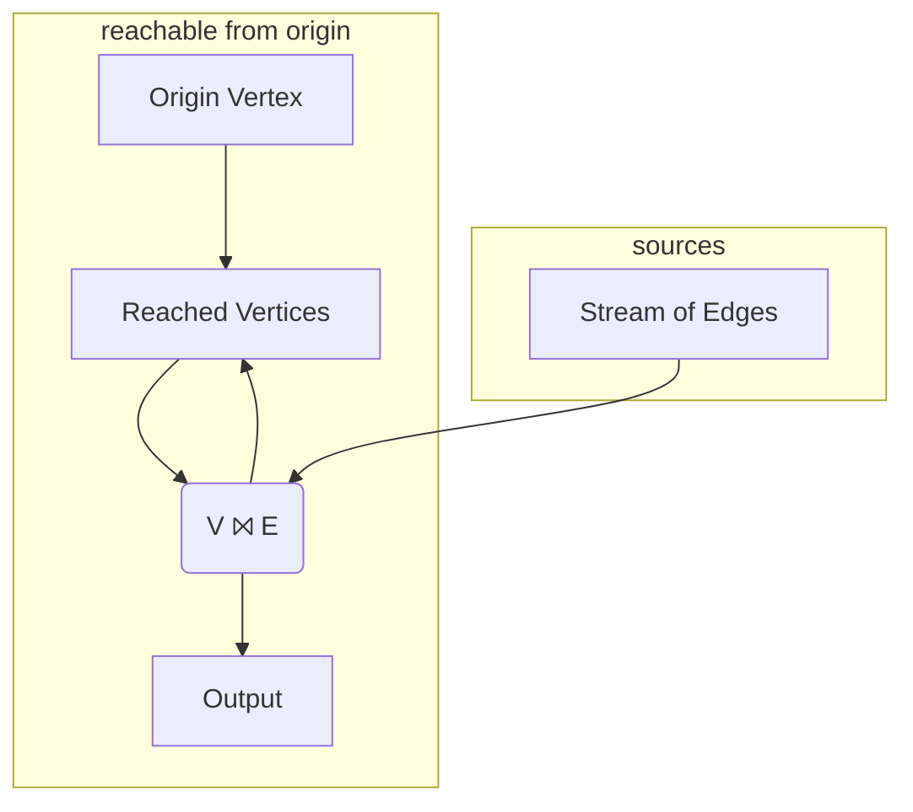

import CodeBlock from '@theme/CodeBlock';
import exampleCode from '!!raw-loader!../../../../hydroflow/examples/example_5_reachability.rs';
import exampleOutput from '!!raw-loader!../../../../hydroflow/tests/snapshots/surface_examples__example_5_reachability.snap';
import { getLines, extractOutput, extractMermaid } from '../../../src/util';

# Graph Reachability
> In this example we cover:
> * Implementing a recursive algorithm (graph reachability) via cyclic dataflow
> * Operators to union data from multiple inputs ([`union`](../syntax/surface_ops_gen.md#union)), and send data to multiple outputs ([`tee`](../syntax/surface_ops_gen.md#tee))
> * Indexing multi-output operators by appending a bracket expression
> * A first example of a cyclic (recursive) flow and the concept of fixpoint.

To expand from graph neighbors to graph reachability, we want to find vertices that are connected not just to `origin`,
but also to vertices reachable *transitively* from `origin`. Said differently, a vertex is reachable from `origin` if it is
one of two cases:
1. a neighbor of `origin` *or*
2. a neighbor of some other vertex that is itself reachable from `origin`.

It turns out this is a very small change to our Hydroflow program! Essentially we want to take *all* the reached vertices we found in our graph neighbors program,
and treat them recursively just as we treated `origin`.
To do this in a language like Hydroflow, we introduce a cycle in the flow:
we take the join output and have it
flow back into the join input. The modified intuitive graph looks like this:

Note that we added a `Reached Vertices` box to the diagram to union the two inbound edges corresponding to our
two cases above. Similarly note that the join box `V ⨝ E` now has two _outbound_ edges; the sketch omits the operator
to copy ("tee") the output along two paths.

Now lets look at a modified version of our [graph neighbor](example_4_neighbors) code that implements this full program, including the loop as well as the Hydroflow [`union`](../syntax/surface_ops_gen.md#union) and [`tee`](../syntax/surface_ops_gen.md#tee).
Modify src/main.rs to look like this:

<CodeBlock language="rust" showLineNumbers>{exampleCode}</CodeBlock>

And now we get the full set of vertices reachable from `0`:

<CodeBlock language="console">{extractOutput(exampleOutput)}</CodeBlock>

## Examining the Hydroflow Code
Let's review the significant changes here. First, in setting up the inputs we have the
addition of the `reached_vertices` variable, which uses the [union()](../syntax/surface_ops_gen.md#union)
op to union the output of two operators into one.
We route the `origin` vertex into it as one input right away:

<CodeBlock language="rust">{getLines(exampleCode, 8, 12)}</CodeBlock>

Note the square-bracket syntax for assigning index names to the multiple inputs to `union()`; this is similar
to the indexes for `join()`, except that (a) union can have an arbitrary number of inputs, (b) the index names can be arbitrary strings, and (c) the indexes are optional can be omitted entirely. (By contrast, recall that
`join()` is defined to take 2 required input indexes, `[0]` and `[1]`). The only reason to assign index names to the inputs of `union()` is for labeling edges in the generated (e.g. Mermaid) graphs.

The next group of statements lays out the join of `reached_vertices` and the `stream_of_edges`.  The `join()` operator is defined to only have one output, but in our program, we need its output twice: once to feed the original `for_each` from above to print output, and also to feed
back to the `union` operator that we called `reached_vertices`. We pass the `join()` output
through a `flat_map()` as before, and then we feed the result into a [`tee()`](../syntax/surface_ops_gen.md#tee) operator,
which is the mirror image of `union()`:  instead of merging many inputs to one output,
it copies one input to many different outputs.  Each input element is _cloned_, in Rust terms, and separate copy is given to each of the outputs. The syntax for the outputs of `tee()` mirrors that of the inputs to union: we can (optionally) *append*
an arbitrary output index name in square brackets to the `tee` or variable. In this example we have `my_join_tee[cycle] ->` and `my_join_tee[print] ->`.

Finally, we process the output of the `join` as passed through the `tee`.
One branch pushes reached vertices back up into the `reached_vertices` variable (which begins with a `union`), while the other
prints out all the reached vertices as in the simple program.

<CodeBlock language="rust">{getLines(exampleCode, 14, 17)}</CodeBlock>

Below is the diagram rendered by [mermaid](https://mermaid-js.github.io/) showing
the structure of the full flow:

<mermaid value={extractMermaid(exampleOutput)}></mermaid>

This is similar to the flow for graph neighbors, but has a few more operators that make it look
more complex. In particular, it includes the `union` and `tee` operators, and a cycle-forming back-edge.
There is also an auto-generated `handoff` operator that enforces the rule that a push producer and a pull consumer must be separated by a `handoff` (see the [Architecture section](../architecture/handoffs)).

# Cyclic Dataflow
Many dataflow and workflow systems are restricted to acyclic graphs (DAGs), but Hydroflow supports cycles, as we see in this example. 