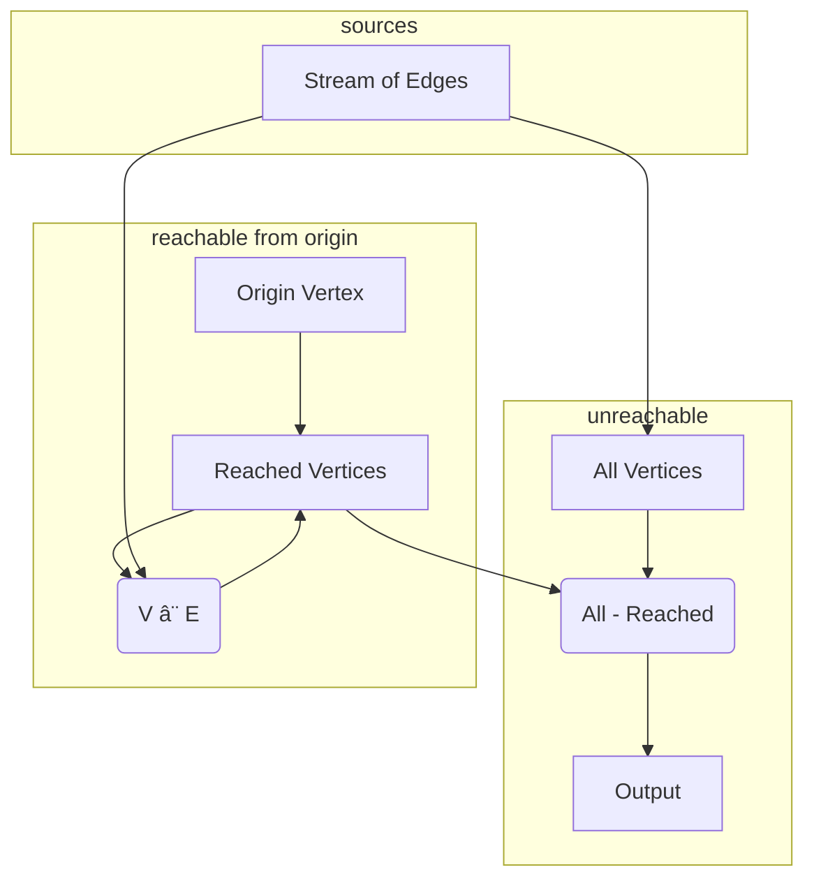

# Graph Un-Reachability
> In this example we cover:
> * Extending a program with additional downstream logic.
> * Hydroflow's ([`difference`](../syntax/surface_ops.gen.md#difference)) operator
> * Further examples of automatic stratification.

Our next example builds on the previous by finding vertices that are _not_ reachable. To do this, we need to capture the set `all_vertices`, and use a [difference](../syntax/surface_ops.gen.md#difference) operator to form the difference between that set of vertices and `reachable_vertices`.

Essentially we want a flow like this:


This is a simple augmentation of our previous example. Replace the contents of `src/main.rs` with the following:

```rust
use hydroflow::hydroflow_syntax;

pub fn main() {
    // An edge in the input data = a pair of `usize` vertex IDs.
    let (pairs_send, pairs_recv) = hydroflow::util::unbounded_channel::<(usize, usize)>();

    let mut flow = hydroflow_syntax! {
        origin = source_iter(vec![0]);
        stream_of_edges = source_stream(pairs_recv) -> tee();
        reached_vertices = merge()->tee();
        origin -> [0]reached_vertices;

        // the join for reachable vertices
        my_join = join() -> flat_map(|(src, ((), dst))| [src, dst]);
        reached_vertices[0] -> map(|v| (v, ())) -> [0]my_join;
        stream_of_edges[1] -> [1]my_join;

        // the loop
        my_join -> [1]reached_vertices;

        // the difference all_vertices - reached_vertices
        all_vertices = stream_of_edges[0]
          -> flat_map(|(src, dst)| [src, dst]) -> tee();
        unreached_vertices = difference();
        all_vertices[0] -> [pos]unreached_vertices;
        reached_vertices[1] -> [neg]unreached_vertices;

        // the output
        all_vertices[1] -> unique() -> for_each(|v| println!("Received vertex: {}", v));
        unreached_vertices -> for_each(|v| println!("unreached_vertices vertex: {}", v));
    };

    println!(
        "{}",
        flow.meta_graph()
            .expect("No graph found, maybe failed to parse.")
            .to_mermaid()
    );

    pairs_send.send((5, 10)).unwrap();
    pairs_send.send((0, 3)).unwrap();
    pairs_send.send((3, 6)).unwrap();
    pairs_send.send((6, 5)).unwrap();
    pairs_send.send((11, 12)).unwrap();
    flow.run_available();
}
```
Notice that we are now sending in some new pairs to test this code. The output should be:
```console
#shell-command-next-line
cargo run
<build output>
<graph output>
Received vertex: 12
Received vertex: 6
Received vertex: 11
Received vertex: 0
Received vertex: 5
Received vertex: 10
Received vertex: 3
unreached_vertices vertex: 12
unreached_vertices vertex: 11
```

Let's review the changes, all of which come at the end of the program. First, 
we remove code to print `reached_vertices`. Then we define `all_vertices` to be
the vertices that appear in any edge (using familiar `flat_map` code from the previous 
examples.) In the last few lines, we wire up a 
[difference](../syntax/surface_ops.gen.md#difference) operator
to compute the difference between `all_vertices` and `reached_vertices`; note 
how we wire up the `pos` and `neg` inputs to the `difference` operator! 
Finally we print both `all_vertices` and `unreached_vertices`.

The auto-generated mermaid looks like so:

If you look carefully, you'll see two subgraphs labeled with `stratum 0`, and two with
`stratum 1`. The reason the strata were broken into subgraphs has nothing to do with
correctness, but rather the way that Hydroflow graphs are compiled and scheduled, as 
discussed in the chapter on [Architecture](../architecture/index.md).

All the subgraphs labeled `stratum 0` are run first to completion, 
and then all the subgraphs labeled `stratum 1` are run. This captures the requirements of the `unique` and `difference` operators used in the lower subgraphs: each has to wait for its full inputs before it can start producing output. Note
how the `difference` operator has two inputs (labeled `pos` and `neg`), and only the `neg` input shows up as blocking (with the bold edge ending in a ball).