import CodeBlock from '@theme/CodeBlock';
import exampleCode from '!!raw-loader!../../../../hydroflow/examples/example_6_unreachability.rs';
import exampleOutput from '!!raw-loader!../../../../hydroflow/tests/snapshots/surface_examples__example_6_unreachability.snap';
import { getLines, extractOutput, extractMermaid } from '../../../src/util';

# Graph Un-Reachability
> In this example we cover:
> * Extending a program with additional downstream logic.
> * Hydroflow's ([`difference`](../syntax/surface_ops_gen.md#difference)) operator
> * A first exposure to the concepts of _strata_ and _ticks_
> * An example of how a cyclic dataflow in one stratum executes to completion before starting the next stratum.

Our next example builds on the previous by finding vertices that are _not_ reachable. To do this, we need to capture the set `all_vertices`, and use a [difference](../syntax/surface_ops_gen.md#difference) operator to form the difference between that set of vertices and `reachable_vertices`.

Essentially we want a flow like this:

```mermaid
graph TD
  subgraph sources
    01[Stream of Edges]
  end
  subgraph reachable from origin
    00[Origin Vertex]
    10[Reached Vertices]
    20("V ⨝ E")

    00 --> 10
    10 --> 20
    20 --> 10

    01 --> 20
  end
  subgraph unreachable
    15[All Vertices]
    30(All - Reached)
    01 ---> 15
    15 --> 30
    10 --> 30
    30 --> 40
   end
40[Output]
```

This is a simple augmentation of our previous example. Replace the contents of `src/main.rs` with the following:

<CodeBlock language="rust" showLineNumbers>{exampleCode}</CodeBlock>

Notice that we are now sending in some new pairs to test this code. The output should be:

<CodeBlock language="console">{extractOutput(exampleOutput)}</CodeBlock>

Let's review the changes, all of which come at the end of the program. First,
we remove code to print `reached_vertices`. Then we define `all_vertices` to be
the vertices that appear in any edge (using familiar `flat_map` code from the previous
examples.) In the last few lines, we wire up a
[difference](../syntax/surface_ops_gen.md#difference) operator
to compute the difference between `all_vertices` and `reached_vertices`; note
how we wire up the `pos` and `neg` inputs to the `difference` operator!
Finally we print both `all_vertices` and `unreached_vertices`.

The auto-generated mermaid looks like so:

<mermaid value={extractMermaid(exampleOutput)}></mermaid>

## Strata and Ticks
Notice in the mermaid graph how Hydroflow separates the `difference` operator and its downstream dependencies into its own
_stratum_ (plural: _strata_). Note also the edge coming into the `neg` input to `difference` is bold and ends in a ball: this is because that input to `difference` is
"blocking", meaning that `difference` should not run until all of the input on that edge has been received.
The stratum boundary before `difference` ensures that the blocking property is respected.

Hydroflow runs each stratum
in order, one at a time, ensuring all values are computed
before moving on to the next stratum. Between strata we see a _handoff_, which logically buffers the
output of the first stratum, and delineates the separation of execution between the 2 strata.

If you look carefully, you'll see two subgraphs labeled with `stratum 0`. The reason that stratum 0 was broken into subgraphs has nothing to do with
correctness, but rather the way that Hydroflow graphs are compiled and scheduled (as
discussed in the section on [In-Out Trees](../architecture/in-out_trees). We need not concern ourselves with this detail other than to look carefully at the `stratum` labels on the grey boxes in our Mermaid diagrams.

All the subgraphs labeled `stratum 0` are run first to completion,
and then all the subgraphs labeled `stratum 1` are run. This captures the requirements of the `difference` operator: it has to wait for its full negative input before it can start producing output. Note
how the `difference` operator has two inputs (labeled `pos` and `neg`), and only the `neg` input shows up as blocking (with the bold edge ending in a ball).

In this Mermaid graph, note that stratum 0 has a recursive loop back through `my_join`, and `tee`s off output to the `difference` operator in stratum 1 via the handoff and the blocking `neg` input. This means that Hydroflow will first run the loop of stratum 0 repeatedly until all the transitive reached vertices are passed to the handoff (a [fixpoint](../concepts/cyclic_flows)), before moving on to compute the unreached vertices via stratum 1.

After all strata are run, Hydroflow returns to stratum 0; this begins the next _tick_. This doesn't really matter for this example, but it is important for long-running Hydroflow services that accept input from the outside world. More on this topic in the chapter on [time](../concepts/life_and_times.md).

