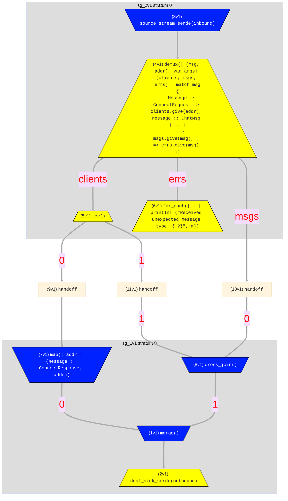
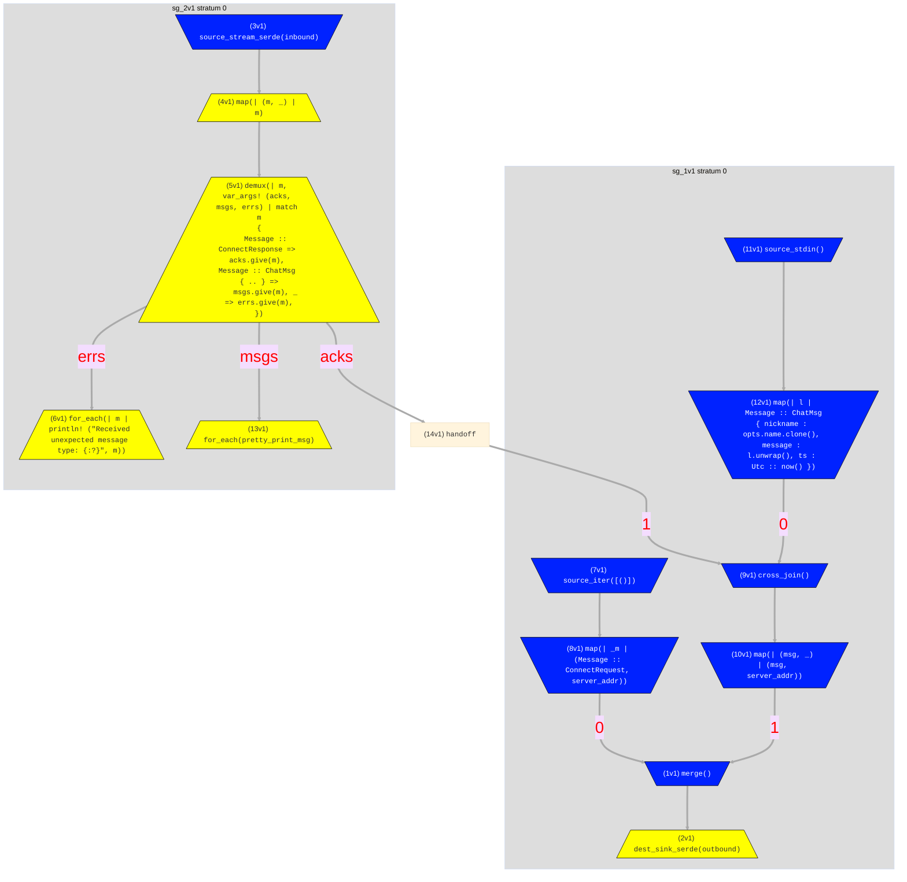

# Networked Services 2: Chat Server
> In this example we cover:
> * Multiple message types and the `demux` operator.
> * A broadcast pattern via the `cross_join` operator.
> * One-time bootstrapping pipelines
> * A "gated buffer" pattern via `cross_join` with a single-object input.

Our previous [echo server](./example_7_echo_server.md) example was admittedly simplistic.  In this example, we'll build something a bit more useful: a simple chat server. We will again have two roles: a `Client` and a `Server`. `Clients` will register their presence with the `Server`, which maintains a list of clients. Each `Client` sends messages to the `Server`, which will then broadcast those messages to all other clients. 

## main.rs
The `main.rs` file here is very similar to that of the echo server, just with two new command-line arguments: one called `name` for a "nickname" in the chatroom, and another optional argument `graph` for printing a dataflow graph if desired. To follow along, you can copy the contents of this file into the `src/main.rs` file of your template.

```rust,ignore
use clap::{Parser, ValueEnum};
use client::run_client;
use hydroflow::tokio;
use hydroflow::util::{bind_udp_bytes, ipv4_resolve};
use server::run_server;
use std::net::SocketAddr;

mod client;
mod protocol;
mod server;

#[derive(Clone, ValueEnum, Debug)]
enum Role {
    Client,
    Server,
}
#[derive(Clone, ValueEnum, Debug)]
enum GraphType {
    Mermaid,
    Dot,
    Json,
}

#[derive(Parser, Debug)]
struct Opts {
    #[clap(long)]
    name: String,
    #[clap(value_enum, long)]
    role: Role,
    #[clap(long, value_parser = ipv4_resolve)]
    client_addr: Option<SocketAddr>,
    #[clap(long, value_parser = ipv4_resolve)]
    server_addr: Option<SocketAddr>,
    #[clap(value_enum, long)]
    graph: Option<GraphType>,
}

#[hydroflow::main]
async fn main() {
    let opts = Opts::parse();
    // if no addr was provided, we ask the OS to assign a local port by passing in "localhost:0"
    let addr = opts
        .addr
        .unwrap_or_else(|| ipv4_resolve("localhost:0").unwrap());

    // allocate `outbound` sink and `inbound` stream
    let (outbound, inbound, addr) = bind_udp_bytes(addr).await;
    println!("Listening on {:?}", addr);

    match opts.role {
        Role::Client => {
            run_client(outbound, inbound, opts).await;
        }
        Role::Server => {
            run_server(outbound, inbound, opts).await;
        }
    }
}
```

## protocol.rs
Our protocol file here expands upon what we saw with the echoserver by defining multiple message types. 
Replace the template contents of `src/protocol.rs` with the following:
```rust,ignore
use chrono::prelude::*;
use serde::{Deserialize, Serialize};

#[derive(PartialEq, Eq, Clone, Serialize, Deserialize, Debug)]
pub enum Message {
    ConnectRequest,
    ConnectResponse,
    ChatMsg {
        nickname: String,
        message: String,
        ts: DateTime<Utc>,
    },
}
```

Note how we use a single Rust `enum` to represent all varieties of message types; this allows us to handle `Message`s of different types with a single  Rust network channel. We will use the [`demux`](../syntax/surface_ops.gen.md#demux) operator to separate out these different message types on the receiving end. 

The `ConnectRequest` and `ConnectResponse` messages have no payload; 
the address of the sender and the type of the message will be sufficient information. The `ChatMsg` message type has a `nickname` field, a `message` field, and a `ts` 
field for the timestamp. Once again we use the `chrono` crate to represent timestamps.

## server.rs
The chat server is nearly as simple as the echo server. The main differences are (a) we need to handle multiple message types, 
(b) we need to keep track of the list of clients, and (c) we need to broadcast messages to all clients. 

To follow along, replace the contents of `src/server.rs` with the code below:

```rust,ignore
use crate::{GraphType, Opts};
use hydroflow::util::{UdpSink, UdpStream};

use crate::protocol::Message;

use hydroflow::hydroflow_syntax;
use hydroflow::scheduled::graph::Hydroflow;

pub(crate) async fn run_server(outbound: UdpSink, inbound: UdpStream, opts: Opts) {
    println!("Server live!");

    let mut df: Hydroflow = hydroflow_syntax! {
        // Define shared inbound and outbound channels
        outbound_chan = merge() -> dest_sink_serde(outbound);
        inbound_chan = source_stream_serde(inbound)
            ->  demux(|(msg, addr), var_args!(clients, msgs, errs)|
                    match msg {
                        Message::ConnectRequest => clients.give(addr),
                        Message::ChatMsg {..} => msgs.give(msg),
                        _ => errs.give(msg),
                    }
                );
        clients = inbound_chan[clients] -> tee();
        inbound_chan[errs] -> for_each(|m| println!("Received unexpected message type: {:?}", m));
```

After a short prelude, we have the Hydroflow code near the top of `run_server()`. It begins by defining `outbound_chan` as a `merge`d destination sink for network messages. Then we get to the
more interesting `inbound_chan` definition. 

The `inbound` channel is a source stream that will carry many
types of `Message`s. We use the [`demux`](../syntax/surface_ops.gen.md#demux) operator to partition the stream objects into three channels. The `clients` channel 
will carry the addresses of clients that have connected to the server. The `msgs` channel will carry the `ChatMsg` messages that clients send to the server. 
The `errs` channel will carry any other messages that clients send to the server. 

Note the structure of the `demux` operator: it takes a closure on 
`(Message, SocketAddr)` pairs, and a variadic tuple (`var_args!`) of output channel names—in this case `clients`, `msgs`, and `errs`. The closure is basically a big
Rust pattern [`match`](https://doc.rust-lang.org/book/ch06-02-match.html), with one arm for each output channel name given in the variadic tuple. Note 
that the different output channels can have different-typed messages! Note also that we destructure the incoming `Message` types into tuples of fields. (If we didn't we'd either have to write boilerplate code for each message type in every downstream pipeline, or face Rust's dreaded [refutable pattern](https://doc.rust-lang.org/book/ch18-02-refutability.html) error!)


The remainder of the server consists of two independent pipelines, the code to print out the flow graph,
and the code to run the flow graph. To follow along, paste the following into the bottom of your `src/server.rs` file:
```rust,ignore
       // Pipeline 1: Acknowledge client connections
        clients[0] -> map(|addr| (Message::ConnectResponse, addr)) -> [0]outbound_chan;

        // Pipeline 2: Broadcast messages to all clients
        broadcast = cross_join() -> [1]outbound_chan;
        inbound_chan[msgs] -> [0]broadcast;
        clients[1] -> [1]broadcast;
    };

    if let Some(graph) = graph {
        let serde_graph = df
            .meta_graph()
            .expect("No graph found, maybe failed to parse.");
        match graph {
            GraphType::Mermaid => {
                println!("{}", serde_graph.to_mermaid());
            }
            GraphType::Dot => {
                println!("{}", serde_graph.to_dot())
            }
            GraphType::Json => {
                unimplemented!();
                // println!("{}", serde_graph.to_json())
            }
        }
    }

    df.run_async().await.unwrap();
}
```

The first pipeline is one line long, 
and is responsible for acknowledging requests from `clients`: it takes the address of the incoming `Message::ConnectRequest` 
and sends a `ConnectResponse` back to that address. The second pipeline is responsible for broadcasting 
all chat messages to all clients. This all-to-all pairing corresponds to the notion of a cartesian product
or [`cross_join`](../syntax/surface_ops.gen.md#cross_join) in Hydroflow. The `cross_join` operator takes two input 
channels and produces a single output channel with a tuple for each pair of inputs, in this case it produces
`(Message, SocketAddr)` pairs. Conveniently, that is exactly the structure needed for sending to the `outbound_chan` sink!
We call the cross-join pipeline `broadcast` because it effectively broadcasts all messages to all clients.


The mermaid graph for the server is below. The three branches of the `demux` are very clear toward the top. Note also the `tee` of the `clients` channel
for both `ClientResponse` and broadcasting, and the `merge` of all outbound messages into `dest_sink_serde`.



## client.rs
The chat client is not very different from the echo server client, with two new design patterns:
 1. a degenerate `source_iter` pipeline that runs once 
as a "bootstrap" in the first tick
 2. the use of `cross_join` as a "gated buffer" to postpone sending messages.

We also include a Rust helper routine `pretty_print_msg` for formatting output.

The prelude of the file is almost the same as the echo server client, with the addition of a crate for 
handling `colored` text output. This is followed by the `pretty_print_msg` function, which is fairly self-explanatory. 
To follow along, start by replacing the contents of `src/client.rs` with the following:

```rust,ignore
use crate::protocol::Message;
use crate::{GraphType, Opts};
use chrono::prelude::*;
use hydroflow::hydroflow_syntax;
use hydroflow::util::{UdpSink, UdpStream};

use chrono::Utc;
use colored::Colorize;

fn pretty_print_msg(msg: Message) {
    if let Message::ChatMsg {
        nickname,
        message,
        ts,
    } = msg
    {
        println!(
            "{} {}: {}",
            ts.with_timezone(&Local)
                .format("%b %-d, %-I:%M:%S")
                .to_string()
                .truecolor(126, 126, 126)
                .italic(),
            nickname.green().italic(),
            message,
        );
    }
}
```

This brings us to the `run_client` function. As in `run_server` we begin by ensuring the server address 
is supplied. We then have the hydroflow code starting with a standard pattern of a `merge`d `outbound_chan`, 
and a `demux`ed `inbound_chan`. The client handles only two inbound `Message` types: `Message::ConnectResponse` and `Message::ChatMsg`.

Paste the following to the bottom of `src/client.rs`:
```rust,ignore
pub(crate) async fn run_client(outbound: UdpSink, inbound: UdpStream, opts: Opts) {
    // server_addr is required for client
    let server_addr = opts.server_addr.expect("Client requires a server address");
    println!("Client live!");

    let mut hf = hydroflow_syntax! {
        // set up channels
        outbound_chan = merge() -> dest_sink_serde(outbound);
        inbound_chan = source_stream_serde(inbound) -> map(|(m, _)| m)
            ->  demux(|m, var_args!(acks, msgs, errs)|
                    match m {
                        Message::ConnectResponse => acks.give(m),
                        Message::ChatMsg {..} => msgs.give(m),
                        _ => errs.give(m),
                    }
                );
        inbound_chan[errs] -> for_each(|m| println!("Received unexpected message type: {:?}", m));
```
The core logic of the client consists of three dataflow pipelines shown below. Paste this into the
bottom of your `src/client.rs` file.

```rust,ignore
        // send a single connection request on startup
        source_iter([()]) -> map(|_m| (Message::ConnectRequest, server_addr)) -> [0]outbound_chan;

        // take stdin and send to server as a msg
        // the cross_join serves to buffer msgs until the connection request is acked
        msg_send = cross_join() -> map(|(msg, _)| (msg, server_addr)) -> [1]outbound_chan;
        lines = source_stdin()
          -> map(|l| Message::ChatMsg {
                    nickname: opts.name.clone(),
                    message: l.unwrap(),
                    ts: Utc::now()})
          -> [0]msg_send;
        inbound_chan[acks] -> [1]msg_send;

        // receive and print messages
        inbound_chan[msgs] -> for_each(pretty_print_msg);
    };
```

1. The first pipeline is the "bootstrap" alluded to above.
It starts with `source_iter` operator that emits a single, opaque "unit" (`()`) value. This value is available when the client begins, which means 
this pipeline runs once, immediately on startup, and generates a single `ConnectRequest` message which is sent to the server.

2. The second pipeline reads from `source_stdin` and sends messages to the server. It differs from our echo-server example in the use of a `cross_join`
with `inbound_chan[acks]`. This cross-join is similar to that of the server: it forms pairs between all messages and all servers that send a `ConnectResponse` ack. 
In principle this means that the client is broadcasting each message to all servers.
In practice, however, the client establishes at most one connection to a server. Hence over time, this pipeline starts with zero `ConnectResponse`s and is sending no messages; 
subsequently it receives a single `ConnectResponse` and starts sending messages. The `cross_join` is thus effectively a buffer for messages, and a "gate" on that buffer that opens 
when the client receives its sole `ConnectResponse`.

3. The final pipeline simply pretty-prints the messages received from the server.

Finish up the file by pasting the code below for optionally generating the graph and running the flow:
```rust,ignore
    // optionally print the dataflow graph
    if let Some(graph) = opts.graph {
        let serde_graph = hf
            .meta_graph()
            .expect("No graph found, maybe failed to parse.");
        match graph {
            GraphType::Mermaid => {
                println!("{}", serde_graph.to_mermaid());
            }
            GraphType::Dot => {
                println!("{}", serde_graph.to_dot())
            }
            GraphType::Json => {
                unimplemented!();
            }
        }
    }

    hf.run_async().await.unwrap();
}
```

The client's mermaid graph looks a bit different than the server's, mostly because it routes some data to
the screen rather than to an outbound network channel.


## Running the example
As described in `hydroflow/hydroflow/example/chat/README.md`, we can run the server in one terminal, and run clients in additional terminals.
The client and server need to agree on `server-addr` or this won't work!

Fire up the server in terminal 1:
```console
#shell-command-next-line
cargo run -p hydroflow --example chat -- --name "_" --role server --server-addr 127.0.0.1:12347
```

Start client "alice" in terminal 2 and type some messages, and you'll see them 
echoed back to you. This will appear in colored fonts in most terminals
(but unfortunately not in this markdown-based book!)
```console
#shell-command-next-line
cargo run -p hydroflow --example chat -- --name "alice" --role client --server-addr 127.0.0.1:12347
Listening on 127.0.0.1:50617
Connecting to server at 127.0.0.1:12347
Client live!
Hello (hello hello) ... is there anybody in here?
Dec 13, 12:04:34 alice: Hello (hello hello) ... is there anybody in here?
Just nod if you can hear me.
Dec 13, 12:04:58 alice: Just nod if you can hear me.
Is there anyone home?
Dec 13, 12:05:01 alice: Is there anyone home?
```

Now start client "bob" in terminal 3, and notice how he instantly receives the backlog of Alice's messages from the server's `cross_join`. 
(The messages may not be printed in the same order as they were timestamped! The `cross_join` operator is not guaranteed to preserve order, nor
is the udp network. Fixing these issues requires extra client logic that we leave as an exercise to the reader.)
```console
#shell-command-next-line
cargo run -p hydroflow --example chat -- --name "bob" --role client --server-addr 127.0.0.1:12347
Listening on 127.0.0.1:63018
Connecting to server at 127.0.0.1:12347
Client live!
Dec 13, 12:05:01 alice: Is there anyone home?
Dec 13, 12:04:58 alice: Just nod if you can hear me.
Dec 13, 12:04:34 alice: Hello (hello hello) ... is there anybody in here?
```
Now in terminal 3, Bob can respond:
```console
*nods*
Dec 13, 12:05:05 bob: *nods*
```
and if we go back to terminal 2 we can see that Alice gets the message too:
```console
Dec 13, 12:05:05 bob: *nods*
```
