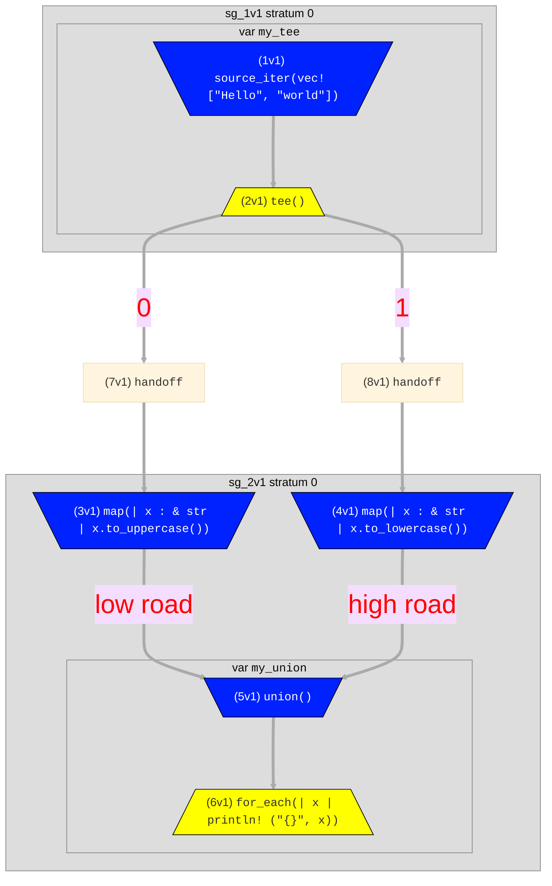

# Flow Syntax
Flows consist of named _operators_ that are connected via flow _edges_ denoted by `->`. The example below
uses the [`source_iter`](./surface_ops_gen.md#source_iter) operator to generate two strings from a Rust `vec`, the
[`map`](./surface_ops_gen.md#map) operator to apply some Rust code to uppercase each string, and the [`for_each`](./surface_ops_gen.md#for_each)
operator to print each string to stdout.
```rust,ignore
source_iter(vec!["Hello", "world"])
    -> map(|x| x.to_uppercase()) -> for_each(|x| println!("{}", x));
```

Flows can be assigned to variable names for convenience. E.g, the above can be rewritten as follows:
```rust,ignore
source_iter(vec!["Hello", "world"]) -> upper_print;
upper_print = map(|x| x.to_uppercase()) -> for_each(|x| println!("{}", x));
```
Note that the order of the statements (lines) doesn't matter. In this example, `upper_print` is
referenced before it is assigned, and that is completely OK and better matches the flow of
data, making the program more understandable.

## Operators with Multiple Ports
Some operators have more than one input _port_ that can be referenced by `->`. For example [`union`](./surface_ops_gen.md#union)
unions the contents of many flows, so it can have an abitrary number of input ports. Some operators have multiple outputs, notably [`tee`](./surface_ops_gen.md#tee), and [`demux`](./surface_ops_gen.md#demux)
which have an arbitrary number of outputs.

In the syntax, we optionally distinguish input ports via an _indexing prefix_ string
in square brackets before the name (e.g. `[0]my_union` and `[1]my_union`). Binary operators—those with two distinct input ports—require indexing prefixes to distinguish them.
Operators with arbitrary numbers of inputs ([`union`](./surface_ops_gen.md#union)) and outputs 
([`demux`](./surface_ops_gen.md#demux), [`tee`](./surface_ops_gen.md#tee)) 
allow for arbitrary strings, which can make code and dataflow graphs more readable and understandable
(e.g. `my_tee[print]` and `my_tee[continue]`).

Here is an example that tees one flow into two, handles each separately, and then unions them to print out the contents in both lowercase and uppercase:
```rust,ignore
my_tee = source_iter(vec!["Hello", "world"]) -> tee();
my_tee -> map(|x| x.to_uppercase()) -> [low_road]my_union;
my_tee -> map(|x| x.to_lowercase()) -> [high_road]my_union;
my_union = union() -> for_each(|x| println!("{}", x));
```
Here is a visualization of the flow that was generated. Note that the outbound labels to `my_tee` 
were auto-generated, but the inbound labels to `my_union` were specified by the code above:

Hydroflow compiled this flow into two subgraphs called _compiled components_, connected by _handoffs_. You can ignore
these details unless you are interested in low-level performance tuning; they are explained in the discussion
of [in-out trees](../architecture/in-out_trees.md).
## The `context` object

Closures inside surface syntax operators have access to a special `context` object which provides
access to scheduling, timing, and state APIs. The object is accessible as a shared reference
(`&Context`) via the special name `context`.
[Here is the full API documentation for `Context`](https://hydro-project.github.io/hydroflow/doc/hydroflow/scheduled/context/struct.Context.html).

```rust,ignore
source_iter([()])
    -> for_each(|()| println!("Current tick: {}, stratum: {}", context.current_tick(), context.current_stratum()));
// Current tick: 0, stratum: 0
```
