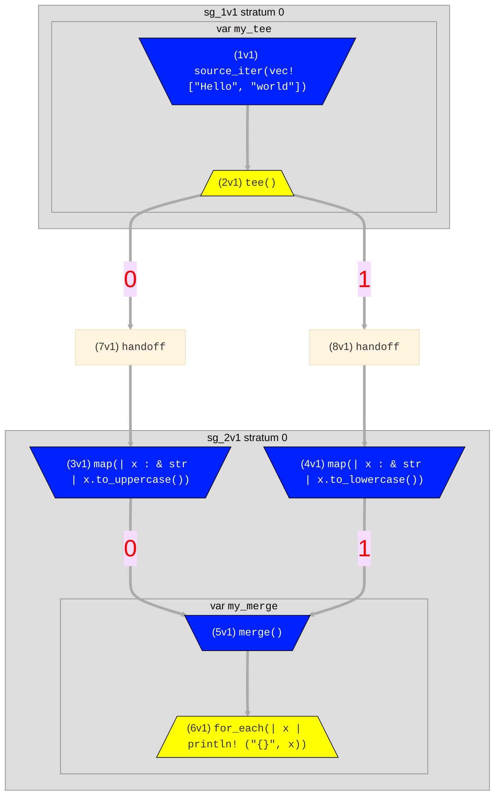

# Flow Syntax
Flows consist of named _operators_ that are connected via flow _edges_ denoted by `->`. The example below
uses the [`source_iter`](./surface_ops.gen.md#source_iter) operator to generate two strings from a Rust `vec`, the
[`map`](./surface_ops.gen.md#map) operator to apply some Rust code to uppercase each string, and the [`for_each`](./surface_ops.gen.md#for_each)
operator to print each string to stdout.
```rust,ignore
source_iter(vec!["Hello", "world"])
    -> map(|x| x.to_uppercase()) -> for_each(|x| println!("{}", x));
```

Flows can be assigned to variable names for convenience. E.g, the above can be rewritten as follows:
```rust,ignore
source_iter(vec!["Hello", "world"]) -> upper_print;
upper_print = map(|x| x.to_uppercase()) -> for_each(|x| println!("{}", x));
```
Note that the order of the statements (lines) doesn't matter. In this example, `upper_print` is
referenced before it is assigned, and that is completely OK and better matches the flow of
data, making the program more understandable.

## Operators with Multiple Ports
Some operators have more than one input _port_ that can be referenced by `->`. For example [`merge`](./surface_ops.gen.md#merge)
merges the contents of many flows, so it can have an abitrary number of input ports. Some operators have multiple outputs, notably [`tee`](./surface_ops.gen.md#tee),
which has an arbitrary number of outputs.

In the syntax, we optionally distinguish input ports via an _indexing prefix_ number
in square brackets before the name (e.g. `[0]my_join` and `[1]my_join`). We
can distinguish output ports by an _indexing suffix_ (e.g. `my_tee[0]`).

Here is an example that tees one flow into two, handles each separately, and then merges them to print out the contents in both lowercase and uppercase:
```rust,ignore
my_tee = source_iter(vec!["Hello", "world"]) -> tee();
my_tee -> map(|x| x.to_uppercase()) -> my_merge;
my_tee -> map(|x| x.to_lowercase()) -> my_merge;
my_merge = merge() -> for_each(|x| println!("{}", x));
```
`merge()` and `tee()` treat all their input/outputs the same, so we omit the indexing.

Here is a visualization of the flow that was generated:

Hydroflow compiled this flow into two subgraphs called _compiled components_, connected by _handoffs_. You can ignore
these details unless you are interested in low-level performance tuning; they are explained in the discussion
of [in-out trees](../architecture/in-out_trees.md).

### A note on assigning flows with multiple ports
> *TODO*: _Need to document the port numbers for variables assigned to tree- or dag-shaped flows_

## The `context` object

Closures inside surface syntax operators have access to a special `context` object which provides
access to scheduling, timing, and state APIs. The object is accessible as a shared reference
(`&Context`) via the special name `context`.
[Here is the full API documentation for `Context`](https://hydro-project.github.io/hydroflow/doc/hydroflow/scheduled/context/struct.Context.html).

```rust,ignore
source_iter([()])
    -> for_each(|()| println!("Current tick: {}, stratum: {}", context.current_tick(), context.current_stratum()));
// Current tick: 0, stratum: 0
```
