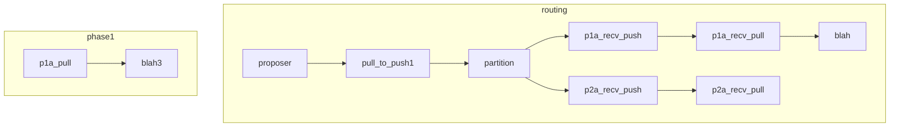
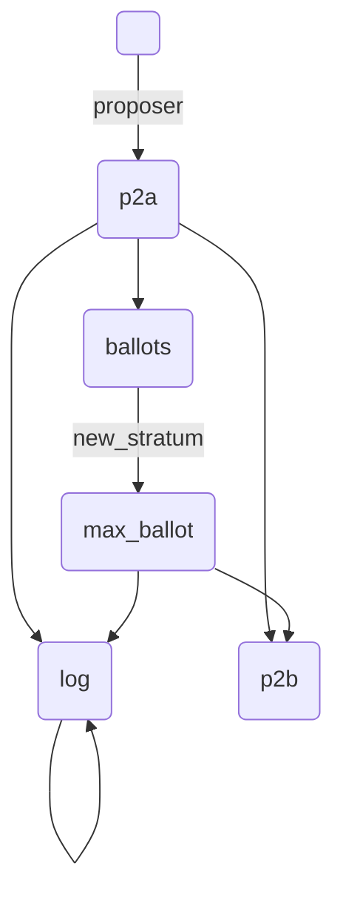

This is a detailed diagram of the dataflow for acceptor logic.

```mermaid
graph TD;
    subgraph routing
        proposer --> pull_to_push1
        pull_to_push1 --> partition
        partition --> p1a_recv_push
        p1a_recv_push --> p1a_recv_pull
        p1a_recv_pull --> blah
        partition --> p2a_recv_push
        p2a_recv_push --> p2a_recv_pull
    end
    subgraph phase1
        p1a_pull --> blah3
        
    end
```

Below is a high level sketch of the way p2a should work.

```mermaid
graph TD
    X( ) -->|proposer| A(p2a)
    A(p2a) --> B(ballots)
    B(ballots) -->|new_stratum| D(max_ballot)
    A(p2a) --> C(log)
    C(log) --> C(log)
    A(p2a) --> E(p2b)
    D(max_ballot) --> E(p2b)
    D(max_ballot) --> C(log)
```