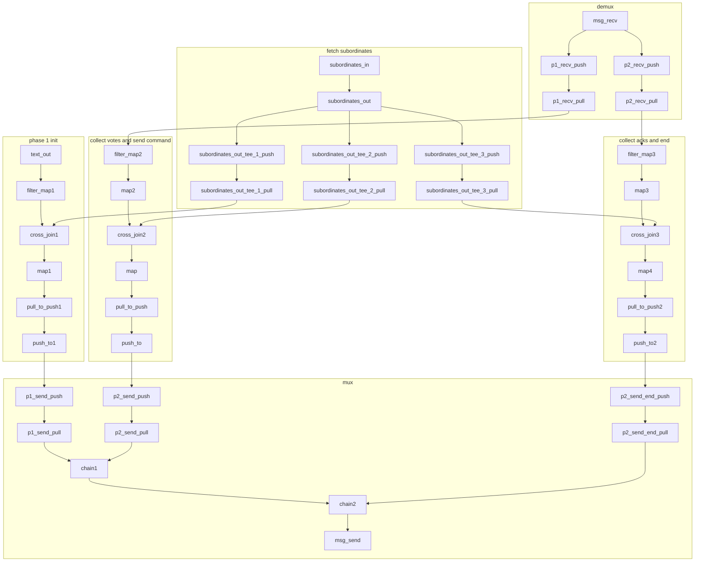
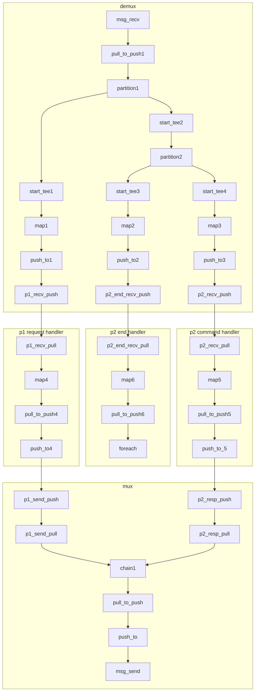

## Two Phase Commit
This is a remedial 2PC implementation. 

Design limitations:
- No database logging (just log statements via println)
- No distinction between forced and non-forced logs, no presumed commit/abort optimizations
- No recovery manager implementation (yet)
- Subordinates make random decisions whether to commit or abort

Temporary Implementation limitations:
- With the current absence of groupby, the size of the subordinate set is hardcoded inline
- With the current absence of groupby, counting is done by moving Rust HashMaps and HashSets into map operators

## Dataflow Overview
This was generated by hand. I skipped the `flatten` steps and did not include the body of the `map`s. I also had to rename (number) all the instances of each operator.

We should automate this -- very useful!
### Coordinator

### Subordinate

### To Run the code:
Look in the file `members.json` to find the addresses of the coordinator and subordinates. 
For the coordinator, launch a process on the node with a matching IP address as follows.
Here we assume the coordinator's IP address is `localhost` and port `12346` is free:
```
cargo run --example two_pc -- --path hydroflow/examples/two_pc/members.json --role coordinator --port 12346 --addr localhost
```

Now for each subordinate, launch a process on the node with the matching IP address as follows.
Here we assume the subordinate's IP address is `localhost` and port `12349` is free:
```
cargo run --example two_pc -- --path hydroflow/examples/two_pc/members.json --role subordinate --addr localhost --port 12349
```

Now, in the coordinator process you can type an integer at `stdin`. Each integer you type is considered a transaction ID, 
and a two-phase commit process is run for that transaction. Votes to commit or abort are randomized.

You should see logging information on screen at both the coordinator and the subordinates.